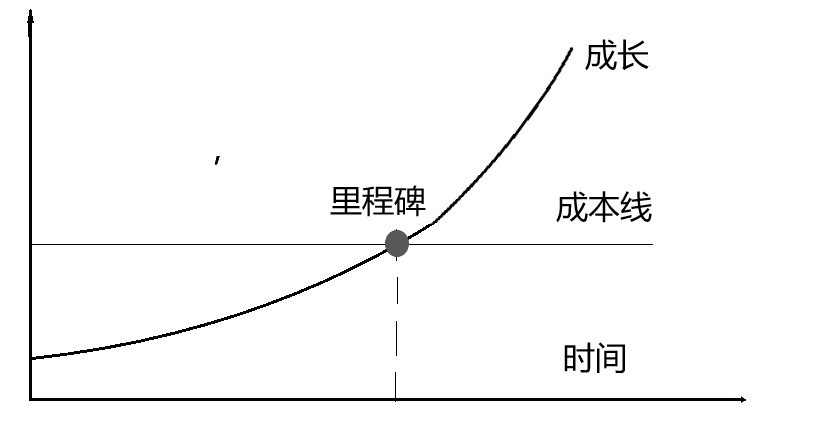

## 1.你知道自己的未来是什么样子的吗？

虽然，我们在学生时代多次写过标题是《我的理想》的作文，虽然我们在长大过程中总是向一些我们心仪的人认真描述自己的未来，但绝大多数人事实上对自己的未来并没有一个清晰直观的认识。没办法，“未来”这个东西在我们的基本感知能力之外，反正五官是不够用的，我们不可能直接"看到未来"、“听到未来”、“摸到未来”、“闻到未来”或者“尝到未来”。

未来这个东西，所有人对它的感知都依赖另外一个器官：**大脑**。不过，绝大多数人没有意识到，大脑事实上和五官一样，是有感知能力的，而且，大脑的感知能力绝对是可开启、可开发、可挖掘、可发展的。细想想就能知道，所谓“**第六感**”，事实上就是指这个器官（大脑）的感知能力。

>在这本书里，你会不断看到我在“重新定义”我们大脑中的各种概念。
>“第六感”就是这样一个会被我重新定义的概念——它并不神秘，他只是我们的另外一个器官的感知能力而已。对这一点，后面会有更深入的解释。
有没有什么方法，可以让你看到，而且是清晰地看到你的未来呢？别说，还真有。

你的未来

那条曲线就是你的未来——只要你愿意，并且付诸行动，最终就能活出那个形状的曲线。

每个人都有机会，至少有一次机会，可以活出那样一条曲线。可最终，人们各自活成了各自的样子。有些人的曲线上扬了一段时间就回落了，以致终生从未超过那条成本线——无论什么都有成本，生活有成本，习得技能有成本，获得尊重有成本，就连做个坏蛋都有成本。成长这个东西，只有突破了成本线才开始真正有意义，在那之前都是在挣扎……即便是在突破成本线之后，也要继续成长。很多人在达到那个“里程碑”之后，人生曲线没过多久就开始回落，再次回到成本线以下，这种现象极为普遍。

许多年前，当我还在读大学的时候（就是20多年以前）就为自己画了这幅图。那条细细的横线对我来说就是一个巨大的提示，它就在那里清楚地告诉我，我所遇到的一切逆境，所感受到的一切委屈，以及正在经历的一切不开心，其实都是我尚处在成本线之下所致。

但不知道为什么，我就是非常盲目地笃信自己不仅早晚会突破那条成本线，而且一定能活出那样一条曲线——不知道最终刻度是多少的曲线。在我32岁那年，在我的第一本书《TOEFL核心词汇21天突破》出版整整一年的时候，我终于不再为生活所累。而且，除了金钱，我也在各个方面感觉自己终于突破了成本线。当时的我回头看10多年前的那副图，真没想到那个里程碑“来”得如此之快。

写到这里，我突然想起在我小时候发生的一件事情。20世纪80年代末，“万元户”这个概念已经火热好些年了，而我当时只是个高中生。有一天，同学们凑在一起闲扯，说起将来要赚多少钱，大家纷纷说了一个自己以为“最狂野”的数字——其实不过是几万或者几十万，但在那个时候已经是“天文数字”了。轮到我的时候，我不知天高地厚地说：“怎么也得1000万吧！”大家纷纷做呕吐状。许多年过去了，我早就赚到了1000万。可是，这么多年，这么大的通货膨胀率，怎么可能是当年的一个中学生可以想象的呢？

我一度以为自己是个很“狂妄”的人，直到有一天我读到孙正义的故事。孙正义在创办软银（Soft Bank）之后，招了三个员工，给他们开会。他站在纸箱上，对员工们说：“今天，软银成立了，它将是世界上最伟大的公司……以后，我就是世界首富，你们就分别是第二、第三、第四！”员工们吓坏了，当场就有两个员工辞职——当然，那两个辞职的员工在许多年后只有后悔的份儿了。

孙正义的故事告诉我，我还是个很“脚踏实地”的人。可是，许多年后，当我反思时，另外一个念头让我惴惴不安：我今天的成就远不及孙正义，有没有可能是因为当年处在起点时就远不及他“狂妄”？——虽说这“狂妄”我不一定做得到。可是，换一种朴素的说法，“想到才能做到”——没想到又如何确定能做到？后来做到了，之前却没想到，那就是运气成分居多，不是吗？

最近10多年，我一直鼓励身边的人，尤其是年轻人。我告诉他们，“要对自己的美好未来盲目相信”，甚至要“120%地相信”——哪怕被别人泼冷水，打击掉20%，依然是“100%地相信”。不仅如此，一旦发现只剩下100%了，还是要主动想办法把这个述职重新培养至120%。

我甚至鼓励他们把已经赚到的钱全部花掉（当然，不能借钱去花）。逻辑其实很简单：如果你笃信自己的未来是那样一条曲线，那某地成本线被突破之前那段长长的时间里，你能赚到的钱实际上全都是“小钱”，小到“不值得节省”的地步——就算要省，也省不出多少……虽然这并不符合传统的教育观念，但我不仅认同，而却长期以来就是这么做的。在我身边这么做的人也有不少，大家熟悉的罗永浩就是其中之一。我们的理由都一样：根本不相信自己将来赚不到钱。

对，就是那条曲线，那条曲线就是你必须笃信的那个属于你的未来。人生很少有必须盲目对待的事情，这倒是其中一件。

## [返回目录](./menu.md)
