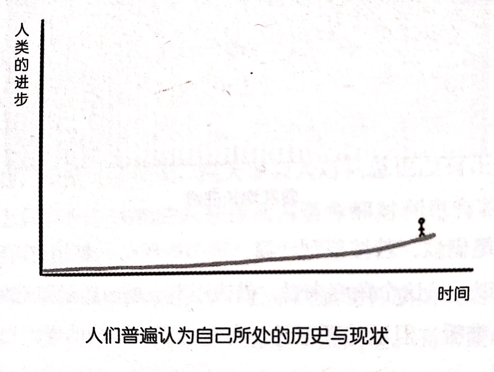
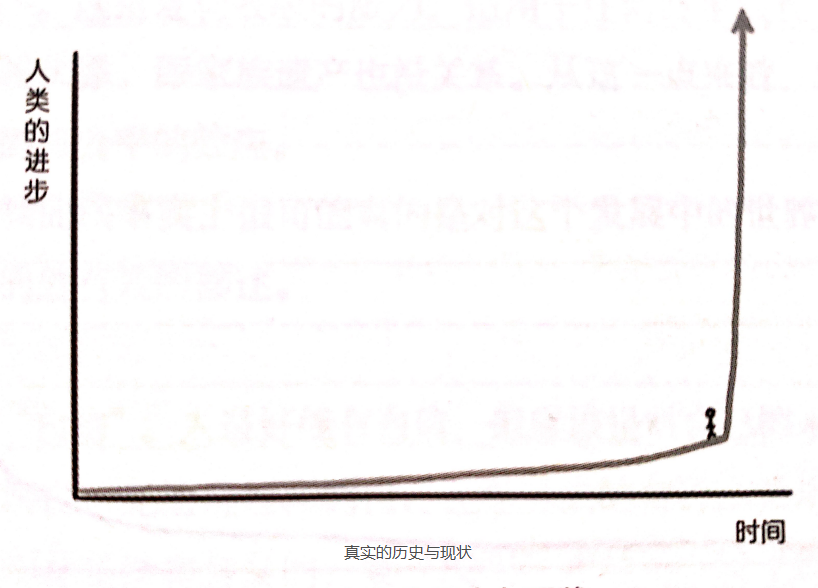
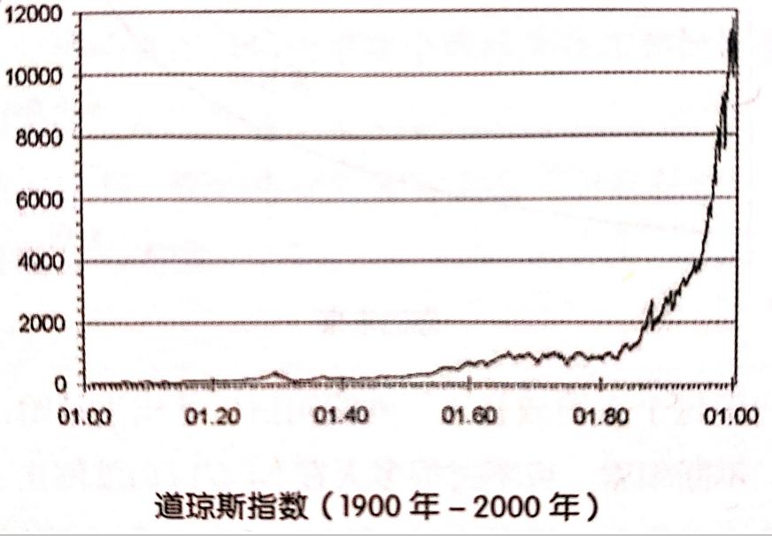
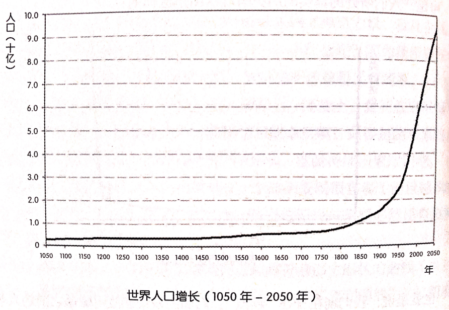
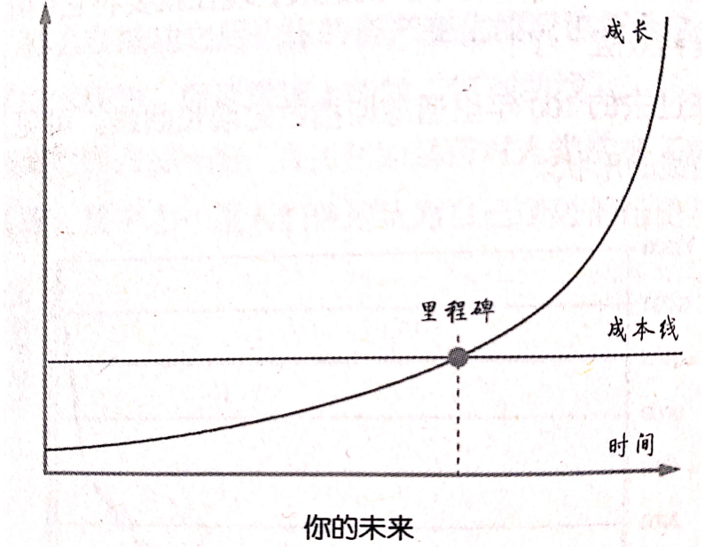

## 2.你知道那条曲线究竟是什么吗？

爱因斯坦说过这样一句话:

>  Compound interest is the eighth wonder of the world.He who understands it,earns it...he who doesn't...pays it.(复利是“世界第八大奇迹”。知之者赚，不知者被赚。)

​		对绝大多数人来说，复利只不过是高中数学课本里的一个概念而已，做几道应用题之后就与自己的生活全无关系了。别说复利，事实上，连利息都不见得是每个人都真正完全理解的概念。

**利息**，毋庸置疑，在今天这个世界里是个极为简单的概念，也恰恰因为如此，它是个极好的例子，可以用来说明：

> 无论多么简单的概念，都是人类耗费许多年（甚至几千年）才逐步弄命白，并通过反复遗忘、反复教育、反复更迭才彻底弄明白的。

​		人们普遍且自然而然地接受利息的存在（或者说“单利计算”）其实不过是近百年的事情。在中国人的印象里，“利滚利”这种缺德事是黄世仁那种混蛋为了霸占喜儿才干得出来的……

​		试想一下，如果在几千年前，某个人在春天的时候向邻居借了一点种子，到了秋天要归还种子的时候，是不是会自然而然地多还一些粮食？

​		抑或，某个人从别人哪里借了一只母鸡，等母鸡下蛋并孵出小鸡之后，是不是要多还几只小鸡？借鸡生蛋之后，把鸡还回去，把蛋全部留下来——估计会挨打吧。

​		可是在借钱的时候，人们却不愿意支付利息。为什么呢？根本原因只不过是笨蛋们的特点从古至今都是一样的：

​		**事情哪怕只复杂一层，就完全无法理解，更别提复杂一层以上了。**

​		笨蛋去找朋友，想要借一只鸡，可是朋友也只有一只鸡，而且家里的娃天天等着鸡下蛋吃。朋友想到自己还有是个贝壳，可以在市场上换一只母鸡，于是处于好心把贝壳借给了笨蛋。笨蛋在市场上用十个贝壳换回了一只母鸡，鸡生蛋、蛋生鸡……过了一段时间，笨蛋想起当初的事，就抱着一只生出来的母鸡去市场上换了十个贝壳，拿回去还给朋友。朋友说：“嗯？你应该给我至少二十个贝壳吧？”笨蛋愤怒了：“你怎么可以这么无耻？！你借给我的明明是十个贝壳！那些贝壳如果不借给我，放在那里也是放着，难道它们会自动变成二十个？那些鸡可是我辛辛苦苦养出来的，你什么都没干就想多要十个贝壳？！你太坏了……”

​		笨蛋之所以总是理直气壮，是因为他们思考不全面，却总以为自己思考全面。笨蛋忘了，朋友其实可以自己拿十个贝壳去市场上换一只鸡，同样可以鸡生蛋、蛋生鸡，用生下来的鸡换更多的贝壳。虽然贝壳看起来是“死”的，放在那里也不会“自动”生出新的贝壳，但这并不意味着那些贝壳如果不被笨蛋借走就一定永远只是放在那里。

​		**别笑，别以为自己不是笨蛋——我们每个人都有可能是，或者必然曾经是。**

​		从整体看，即便到了今天，绝大多数人对利息也没有正确的认识。迄今为止，地球上只有一个民族的人好像从古至今都对利息有着透彻的了解，那就是犹太人——爱因斯坦就是犹太人。

​		从历史上看，犹太人长期被迫害、若干次遭受种族清洗的最根本原因就是他们放高利贷，招人恨——说穿了，是找笨蛋们恨。而笨蛋群体几乎无所不包——科学家、哲学家、道学家、政客、强盗和平民百姓。

​		地球上的每一个宗教，至今都有严格的教义来禁止收取利息，就连精通利息理论的犹太人也不一定认为收取利息的行为是光明正大的。他们的教义规定，“不得向同组人收取任何利息，只允许向外族人收取利息”，这也导致外界的笨蛋们一致认为聪明的犹太人是“昧着良心赚钱的民族”。人们将放高利贷的人称为“Loan Shark”,就是广东话里的“大耳窿”（我猜是“dare loan”的音译），反正一听就知道不是好东西，而“利滚利”听起来就更邪恶了。

​		即便到了今天，虽然现代金融学的基础就是承认并接受利息的存在，也无处不在地应用着复利原理，可是全世界的银行在吸储的时候大都只支付单利，而不是复利——这是银行在故意占便宜。白占便宜是很不厚道的，于是，银行想尽办法教育大众“放高利贷是不好的”（这话还真是部分正确的），老百姓也基本上都相信了，有意无意地把复利和高利贷当成一回事。而所有的政府也都是一样的，处于控制经济的需求，要严格控制利息，这恰好帮了银行的忙。因此，老百姓普遍无法清楚地理解利息也就不足为奇了——要命的是，还真没有几个人认为自己连利息是什么都不懂……

​		可是，利滚利就是一个正常的概念：复利。一笔存款，若可以获取复利，那么它的增长曲线大抵是这样的：

​		于是，一笔借款，若按复利计算，拖欠得越久，就越有可能“永生永世”无法偿还。所以，从这个角度来看，借钱还不上是由愚蠢和无能造成的，怪不得别人。话虽难听，但话糙理不糙。有钱却赚不到钱的原因也是一样的——只能这么理解。		

​		从另外一个角度来看，继承资产的好处（绝大多数人无法享受的好处）是让人有可能在很早的时候就理解利息的原理和复利的神奇力量。我机会从未直接从金钱上获得过复利的神奇力量的支持——为什么呢？因为我没有任何可继承的资产。不仅如此，在35岁之前，我的资产还总是反复清零。

​		不过，**万幸且公平的是，在智力上、知识上、经验上，复利效应对每个人来说都是存在的——这是多么令人喜出望外的事实啊！ **只要是能积累的东西，大都会产生复利效应。如果没有资产可继承，那就持续积累知识吧。

​		我们运气真的很好。我们恰恰活在一个知识变现很容易（而且越来越容易）、变现金额越来越高的时代——对，知识的习得与积累必然是有复利效应的，这一点也毋庸置疑。

​		最后，你会发现，一切有意义的成长过程都符合那个形状的曲线（参见第1节）。金融学里其实也有一模一样的曲线，叫做“复利曲线”。起初看不出太大的斜率，但一旦过了某个时间点，曲线就会极速上扬。对那个看起来斜率突然发生变化的“点”，还有个专门的通俗词汇，叫作“拐点”。如果你想学习投资，那么在成功之后，你的资产变化情况也符合这条曲线——有拐点的、突破了成本线的、后端极速上扬的“复利曲线”。

​		2015年，在全世界有过一场“人工智能是否对人类造成了威胁”的讨论，有几幅图非常震撼，其中之一是人们普遍认为自己所处的历史与现状图：

​		可是，人们所处的真实的历史与现状图是这样的：

​		也就是说，我们现在身处“拐点”，后面的发展速度可能是之前的人类完全没有办法根据历史想象出来的。实际上，这就是“复利曲线”！在过去的几千年里，人类在各个领域都有不小的进展，现在就要将它们混合起来，“利滚利”发挥“复利效应”了！

​		我们看看在过去的100年里道琼斯指数的增长曲线。可见，股市增长曲线依然是复利曲线的形状。

​		再看看世界人口增长曲线——竟然还是一样的！

​		你的未来，也和复利曲线一模一样——再看一遍吧！

​		仔细观察一下每个人的成长过程就能明白，从出生开始，所有人都不断习得各种技能，不断积累，只不过很多人在20岁以后就停止了学习，所以没有机会在自己的未来体会到这种复利效应。然而，少数人在20岁以后仍不断学习，不断进步，他们不仅是终生学习者，甚至像你在读完这本书后变成的那样，还是“**终生成长者**”——只有成长了，才说明把“学到”的东西“做到”了。

​		只是学有什么用？早晚有一天，他们会跨过那个拐点（或称“里程碑”），然后“扬长而去”。这就是复利效应的威力，适用于任何终生成长者，跟长相没关系，跟基因没关系，跟家族遗产也没关系。从这一点来看，复利效应貌似使我们能找到的最公平的效应。

​		所以，复利曲线事实上很可能真的是对这个**发展中的世界**及其中存在的**发展中的个体**的最有效的描述。

​		还没完。

​		有个词叫“自信”。**人最好能有自信，但应该是对自己的未来有自信**。绝大多数人并不明白，无论是现在的自己还是过去的自己，无论是自信、自负还是自卑，其实都是没有意义的，要“现实”才对——错了就是错了，蠢了就是蠢了，该自信的时候自信，该自卑的时候自卑，胡乱自信或者胡乱自卑都是不对的。把自己变得更好才能弥补过往的那些错误，才能承担当初的那些愚蠢造成的后果。

​		为什么有些人格外自信呢？不是因为他们在“装蛋”，也不是因为他们过分自负，而是因为他们一直在搜寻属于自己的“复利式增长曲线”——并且可能已经找到了——所以他们才会那么淡定，多以他们才会那么从容，所以他们才会在种种所谓“逆境”中依然善于保持乐观（其实，如果能真正理解他们，你就会知道，他们不一定觉得苦，他们不是在强作欢颜）。他们笃信自己的未来，**让他们真正自信的是是那个还需要经过漫长等待但其实很快就会到来的瞬间**。

​		我在第1节中说到，要对自己的美好未来“盲目自信”，在这一节中其实给出了最理智的事实依据。

[**返回目录**](./menu.md)
