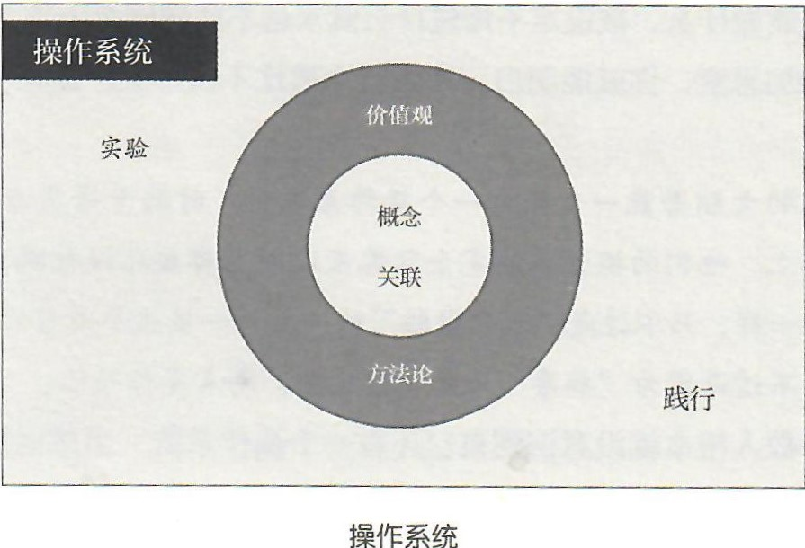

## 9.你升级过自己的操作系统吗？

事实上，在这个问题之前有更基本的问题，在这个问题之后有更深入的问题：

> ▷在此之前，你知道自己有一个操作系统吗？
>
> ▷如果你竟然知道，那么你升级过自己的操作系统吗？
>
> ▷如果你竟然升级过，那么你知道如何持续地甚至自动地升级自己的操作系统吗？

很多人从未想过自己事实上是被一个操作系统所左右的，而那个操作系统到底是不是自己的，很多人也从未有意识地思考过。真相是：

> 很多人在被别人的操作系统所左右。

绝大多数人脑子里确实有个操作系统，但那个操作系统事实上完全不属于他们自己，而是被别人植入的、不受他们自己控制的。那个操作系统完全是由别人设计的——“出厂”的时候什么样就一直什么样，被设定可以做什么就只能做什么，被设定不能做什么就永远不能做什么......

只要略加思考，你就能明白，下面这个类比不仅形象，甚至和事实一模一样：

> 很多人的大脑若能一直保持一个操作系统出厂时的干净状态倒也罢了，可实际上，他买二操作系统完全就像互联网上那些已经被病毒入侵的电脑系统一样，只不过是“僵尸网络”的一员——虽然平时可以正常运作，但那只不过是因为“病毒”还处于潜伏期，尚未发作而已。

绝大多数人根本就没意识到自己还有一个操作系统，当然也绝对不会想到应该给自己按照“杀毒软件”！

> 数学家纳什可能是最广为人知的“通过给抽产出安装杀毒软件而保证自己的操作系统尽量正常运转”的经典例子。
>
> > 在相当长的一段时间里，纳什患上了精神分裂症。他的操作系统被“病毒”入侵，以致产生了各种幻觉。后来，在他的意识里出现了一个小女孩。许多年后，他发现自己意识中的小女孩没有长大，还是那么小——这明显不符合逻辑。由此，他明白了：之前的意识其实是幻觉。于是，他给自己安装了“杀毒软件”，一旦那个小女孩出现，他就主动告诉自己，“那是幻觉”，“那绝对是幻觉”......直到他去世的时候，那个幻觉也没有消失，但他学会了分辨那个幻觉，甚至尝试着适应那个幻觉的存在。
>
> 这个极为震撼的例子在《把时间当作朋友》里就提到过，在本书的后面还会提到。

那么，每个人的操作系统是如何构成的呢?我们应该如何把自己进化成一个具备自动化进化能力的物种呢？

我们的操作系统由如下几个层面构成：

> ▷概念与关联
>
> ▷价值观与方法论
>
> ▷实验与践行

如果可以用图来表示的话，大抵是这个样子的：

我们会在后面多次深入探讨这个“操作系统”，并给出许多重要的实例以帮助你理解它。现在，让我们先对自己的操作系统有一个概括性的认识。

所谓“概念”，无非是你对某个实物（不管它是抽象的还是具象的）的清楚认知。你要清楚地知道：

> ▷它是什么，不是什么？
>
> ▷它和什么东西很像，但在哪些地方完全不一样？
>
> ▷它可以用在哪里，不可以用在哪里？
>
> ▷在用它的时候，怎么用是对的，怎么用是错的，需要注意哪些问题？

其实，衡量一个人是否足够“聪明”的依据很简单：

> ▷看他脑子里有多少清晰、准确、必要的**概念**。
>
> ▷看他脑子里那些清晰、准确、必要的概念之间有多少清晰、准确、必要的**关联**。

前面已经说过，“快速”不应该与“成功”关联在一起，而应该与“入门”关联在一起。很多人只不过是缺失或者搞错了这个简单的关联，就耽误了自己的一生。

概念和关联构成了操作系统的底层核心，其他部分都依赖于他们究竟有多清晰、多准确、多必要。进而，一些价值观会自然形成活自然进化。你得先知道“什么”究竟是什么，才能知道“这个”和“那个”孰优孰劣。而所谓“价值观”，无非是一个“小”问题的真实答案。这个“小”问题是：

> 什么更重要？

认为“金钱比时间更重要”是一种价值观，认为"时间比金钱更重要"是另外一种价值观。价值观决定选择，选择促成行动，行动构成命运——一环扣一环。

有了清晰的价值观，就会有决断（而不是面对选择犹豫不决）。同时，当决断摆在那里的时候，我们会研究方法论，因为选择要配合行动才有意义。因此，我们要锤炼自己的方法论，以指导紧随决断的行动——实验与践行。

践行很容易理解，可为什么要有实验呢？因为我们的“操作系统”并不是一成不变的系统，它和人类所使用的另外一个操作系统——科学——是一样的。科学不是“永恒正确的”。科学是一套具备可证伪性的操作系统，因此它可以在不断否定自我的同时不断进化。而所谓“实验与践行”，几乎完整对应着科学方法论中的“实证”过程。为了进化，我们总是要用实验与践行去检验我们的价值观与方法论，把好的留下继续打磨，把不合适的去掉——这就是升级过程。

若实验与践行的结果不尽人意，我们就要重新审视自己的方法论与价值观；更进一步，为了纠正自己的价值观，改进自己的方法论，我们还要深入一步，去审视我们大脑中存在的概念与关联，甚至需要重新定义它们，让它们更清晰、更准确，或者干脆抛弃一些已然没有必要存在的概念，否则就无法从“根”上完成“升级”（即，“进化”）。

在此之前，你对自己的操作系统有这样清晰、准确、必要的理解吗？更可能的事实是，在此之前，你的脑子里甚至没有“我的操作系统”这个概念。如果连最核心的东西都没有，那么后面的一切就都不见了：

> ▷关联——用在哪里？啊，还要“升级”（“操作系统”与“可升级”的关联。）
>
> ▷价值观——哪个操作系统更好？
>
> ▷方法论——如何升级自己的操作系统？
>
> ▷实验——可能要试用多个操作系统才能作出更优质的选择。
>
> ▷践行——通过持续地“理论指导行动”获得更好的结果。

前面我用“不同的物种”做过类比。还有一个类比可以帮助我们形象地理解人与人之间的差异：

> 一些人脑子里运转着的是单线程操作系统（例如DOS），一些人脑子里运转着的是多线程操作系统（例如Windows），一些人脑子里运转着的是更漂亮的操作系统（例如Mac OS），还有一些人脑子里运转着的是看起来虽然不那么花哨但实际上极为健壮的操作系统（例如Linux）......一些操作系统应该被淘汰（例如DOS），一些操作系统正在不断升级甚至进化（例如Windows10最近的表现），还有一些操作系统本就高效（例如Linux生态中的某些分支）......

事实上，人脑是很神奇的，不仅“软件”可以“自主”升级，“硬件”也可以“自主”升级！精彩的例子太多了，在本书后面会慢慢展开。不过，当前的重点是：你不再像过去那样懵懂，你已经清楚地在“自己的操作系统”里打造了一个“操作系统”的概念，并把它与“升级”、“成长”、“进化”、“自主”等概念关联起来了——你很可能已经变成了“另外一个物种”。

起码，你已经知道：这世界上有很多看起来和你没什么区别，却具备“一个不断自主升级的操作系统”的“另外一个物种”。

[**返回目录**](./menu.md)
