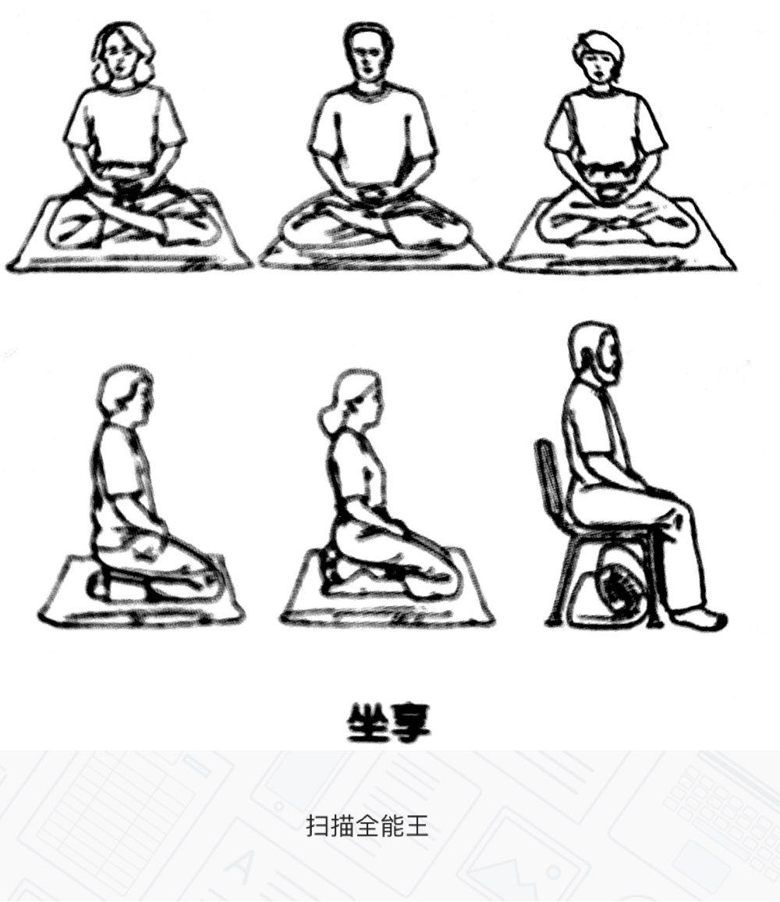

## 11.有没有提高注意力使用效率的科学方法？

具备能够“长时间集中注意力的能力”，几乎是一切所谓“学习能力强”的人最基本的素质。

国内有个著名的云服务商，名字叫“七牛”，创始人许式伟是我的朋友。在我和我的一些朋友眼里，他是个极其聪明的人，学习能力超强。我的另外一个朋友郝培强对许式伟的评价是：“这是我见过的‘入定’速度最快的人。”郝培强不小心用了一个佛教术语——“入定”。我们在一张桌子上吃饭，动不动就会发现许式伟已经沉浸在他自己的世界里，正在想着什么，完全体会不到身边发生的事情。

若不用佛教术语，而是用大白话来描述，就是“这个人很快就能进入注意力100%集中的状态，而且可以长期保持”。

我见过很多具有相同属性的聪明人，他们无一例外，都觉得自己很笨，因为所有让他们显得聪明的思考与结论，在他看来，都是自己花费了太长时间、太大的精力，经历了太多的曲折才得到的。他们也很羡慕（甚至比常人更羡慕，因为他们对自己的“吃力”感受太深切了）那种看起来浑身灵光闪闪的人，可实际上，对这种错觉的解释非常简单且清楚：

> 他们之所以最终真的比别人聪明，是因为：第一，在所有他们曾解决的问题上花费了大量的时间;第二，在单位时间里，他们的注意力运用比更高；两项相乘，才有了极为优质的结果。又因为发生在人脑里的事情别人是看不到的，所以人们总以为那些真正聪明的人仅靠“灵光一闪”就搞定了一切。

一方面，提高自己“长时间集中注意力的能力”的方法简单到“习惯就好了”的地步——虽然简单，但有点含糊。另一方面，人类早就发明了提高这种能力的方法——竟然在2000多年以前！

世界上第一个发明这个方法且系统地传授它的是个印度人，名字叫释迦牟尼。在今天，这种刻意的联系方法有很多名字，如“都坐”、“禅修”、“内视”、“冥想”等。而我生造了一个词，把这种刻意练习方式成为“坐享”。

任何一个清晰、准确、必要的概念，都有如下3个基本要素：

> ▷是什么？（what）
>
> ▷为什么？（why）
>
> ▷怎么做/用？（how）

说实话，人类真的很神奇。历史上，人类在很多领域里，经常是在完全不知道“是什么”（what）和“为什么”（why）的情况下，就早已熟练掌握“怎么做”（how）的方法了。最经典的例子是玻璃：人们在不知道玻璃究竟是什么东西，以及玻璃为什么会是那样的材质的情况下，已经使用它千百年了。意大利人甚至不知道制作过程中搅拌为什么会使玻璃更为透明、杂质和气泡更少的情况下，很好地把“搅拌”这个秘密方法保护了三四百年。

生活中其他的例子还有很多，最明显的例子是性。人类在这个领域里长期愚昧，即便到了今天还是如此——“潮吹”究竟是什么？为什么到现在也没有科学的定论？可早就有大量的人掌握了“怎么做”的方法——地球上第一个为人所知且系统地掌握此项技能的是个日本人，名字叫藤鹰。

还有一个例子是赌博。人类貌似从一开始就带着“好赌”的基因，几乎每个人天生就会赌博。人类甚至在不知道概率是什么的情况下（要知道，概率论的启蒙在17世纪才出现），就不仅能熟练地赌博，还能设计出对庄家胜率倾斜的赌博游戏。

毒品也是如此。很多人既不知道它是什么，也不知道它为什么会给人带来奇异的感受，反正就是知道它该“怎么用”。

其实在人类历史早期，医也好，药也罢，都是如此——“是什么”完全搞错，“为什么”也根本弄不明白，反正直接用就好了。从这个角度来看，“不管三七二十一，用起来再说”从来都是人类的智慧。你现在知道为什么我主张不要闲着没事才学英语，而是一上来就要“用”英语了吧（详见《人人都能用英语》）？

为什么一定要可以编造一个词呢？因为现在和过去不一样了，现在的科学已经可以清楚地解释“是什么”、“为什么”和“怎么做”这3个问题了。所以，我们现在确实有必要把这个已经被科学证明为有效的大脑锻炼方式与过往那些不那么清楚或者干脆错的离谱的解释尽量区分开来。当然，还有一个原因：我们对自己的操作系统有“洁癖”，只喜欢使用清晰、准确、必要的概念。

这有点像什么？就像当我们知道木头可以被点燃其实并不是所谓“燃素”（phlogiston）在起作用，而是由我们的肉眼根本看不到的空气里的氧引发的之后，我们需要抛弃过往的解释，采纳新的解释一样；也像那个让当时的一些人出离愤怒的哥白尼，用太阳替换了地球，“将太阳放到了宇宙中心”一样。我买二生活没有因此发生变化，我们的感受依然是“太阳早晨从东边升起来，晚上在西边落下去”。但事实就是事实，过去我们以为的事实是错的。而值得庆幸的是：我们最终知道了正确的事实。

释迦牟尼是地球上第一个知道如何“坐享”的人，并由此构建了一个系统、庞杂却也足够完整的解释理论：佛教。如此说来，人类联系坐享，因为坐享而获得益处的历史，至少有2500年了——真实神奇得很。

不过，科学发展到今天，脑科学的研究成果越来越明确，已经有足够的证据证明和解释“坐享”究竟有哪些好处（what）,以及为什么会有那样的好处（why）——至于“如何做”（how），人类已经有了200多年的经验。

于是，在科学清楚地解释了“what”和“why”之后，这种刻意的练习方式实际上不必非要与宗教联系在一起了——你一定还记得：概念要清晰、准确、必要，概念之间的关联也要清晰、准确、必要。

这种练习都有哪些好处呢？请看下面的列表。又，为什么会有这些好处呢？若你有兴趣深入研究，请阅读本节注释中列出的相关英文文献。

> **（1）它能让你更健康**
>
> 它能增强你的免疫系统。^[1][2]^
>
> 它能减缓各种疼痛。^[3]^
>
> 它能在细胞层面去除炎症。^[1][4][5]^
>
> **（2）它能让你更快乐**
>
> 它能增加正面的情绪。^[1][6]^
>
> 它能减轻抑郁。^[7]^
>
> 它能消除焦虑。^[8][9][10]^
>
> 它能减缓压力。^[11][12]^
>
> **（3）它能让你更好地社交**
>
> 它能让你对社交联系体会更深，进而改善你的情商。^[6][13]^
>
> 它能让你拥有更多的同情心。^[14][15]^
>
> 它能让你觉得不那么寂寞^[16]^
>
> **（4）它能提高你的自制力**
>
> 它能让你更好地控制自己的情绪。^[17]^
>
> 它能让你有更强的自我审视能力。^[10][18]^
>
> **（5）它能改善你的大脑**
>
> 它能增加大脑灰质的厚度。^[20]^
>
> 它能增加与情绪管理、正面情绪、自制力相关的大脑区域的体积。^[1][20]^
>
> 它能使大脑灰质变得更厚，使你更能集中注意力。^[21]^
>
> **（6）它能提高你的效率**
>
> 它能增强你的注意力和参与度。^[22][23][24][25]^
>
> 它能增强你的多任务处理能力。^[23]^
>
> 它能增强你的记忆力。^[25]^

在花大量时间阅读这些文献的过程中，最令我震惊且信服的事情是：

> **通过坐享（即，所谓“打坐”或者“禅修”）练习，可以使大脑皮层表面积增大，使大脑灰质变厚^[20][21]^。**

回到这一节开始的问题：为什么坐享可以提高“长时间集中注意力的能力”？因为它的练习方式是这样的：

> 把你的注意力全部集中到某件事情上（例如你的呼吸），然后保持。

如何练习坐享呢？实在太简单了——直接开始就好。

（一）**姿势**

在坐享过程中，当注意力足够集中的时候，由于全身放松的状态与人体在睡觉时的状态几乎相同，所以，不仅要注意保暖，还要注意风向。

> ▷可以找张毯子把膝盖盖好。
>
> ▷不要让风持续吹到耳朵周围。

其中，第二条尤其重要。由于三叉神经汇聚于耳部，所以，如果不小心，可能会引起面部偏瘫。

至于姿势，其实并不重要，只要舒服就好（不一定要盘腿），以下任何姿势都可以。因为长时间弓着背可能会更累，所以把脊背挺直是比较重要的。

（二）**步骤**

稍微严肃一点的话，就从以下简单的步骤开始：

> ▷找一个安静的地方。
>
> ▷设定一个计时器（从5分钟或者15分钟开始，渐渐延长到45分钟到1小时）。
>
> ▷用你感觉舒服的方式做好（脊背最好挺直）。
>
> ▷闭上眼睛。
>
> ▷开始深呼吸。
>
> ▷将所有的注意力集中到呼吸上。
>
> ▷一旦发现注意力转移到其他地方，就要刻意将注意力集中到呼吸上。
>
> ▷持续深呼吸......

直至计时器将你“唤醒”。

（三）**进阶**

完成几次坐享之后，就可以尝试在坐享过程中用你的注意力来扫描你的整个身体了。

从左脚的脚尖开始……左脚掌……左脚跟……左小腿……左膝盖……左大腿……左臀……顺着脊柱一直到后脖根……划到左肩……左上臂……左肘……左小臂……左手腕……左手心……左指尖……再回来……左手心……左手腕……左小臂……左肘……左上臂……左肩……沿着肩一直划到右肩……右上臂……右肘……右小臂……右手腕……右手心……右指尖……再回来……右手心……右手腕……右小臂……右肘……右上臂……右肩……回到后脖根……顺着脊柱一直到右臀……右大腿……右膝盖……右小腿……右脚后跟……右脚心……右脚尖……

在这个过程中，你可能会觉得某个地方不舒服。当这种情况发生的时候，把注意力全部集中到那个不舒服的地方，仔细体会自己的感觉，并尝试接受它。这是一个机会，也是一个挑战——一旦你能接受那个原本不舒服的感觉，接下来的感觉竟然是超脱。

（四）**习惯**

尝试在任何地方坐享：出租车上，火车上，飞机上，甚至颠簸的船上，或者某个非常嘈杂的地方……

总而言之，要集中注意力，并最终可以自如地控制注意力，才算是坐享——最终的目标是可以在越来越长的时间里自如地将注意力集中起来，并控制被集中的注意力。而胡思乱想、放空甚至睡着，对增加大脑皮层表面积和大脑灰质厚度没有具体的帮助，所以都不算是坐享。

有没有更简单的方法？

都这么简单了，还要更简单？真实太贪心了！不过，还真有更简单的方法，这个方法也是经过科学验证的：

> 刻意缓慢呼吸两分钟……

很简单吧！从严格意义上将，这是一个能让注意力集中能力更强的辅助方法。所谓"缓慢呼吸"，是指每分钟呼吸5~6次，也就是用10秒钟左右完成一次呼吸。在这么做的时候，你的身体里发生了什么？这样的两分钟缓慢呼吸，会大大提高你的“心律变异度”。

由于我们的心律并不是完全均匀的，所以在任何时刻都有一个“心律变异度”。例如，当你突然极度紧张的时候，心律就会加快。这时，如果你的心律变异度高，那么你的心律会很快恢复到正常水平，从而舒缓你的紧张与不适。但是，如果你的心律变异度低，那么你的心律被抬高之后就相对很难快速恢复正常。换言之，心律变异度的提高对保持正常的心律水平很有帮助。当心律处于正常水平的时候，大脑皮层与大脑灰质的养分供给最为充足，也就是说，大脑处于最佳工作状态，因此，注意力集中能自然而然地使你处于最佳状态。就是这么简单。

所以，这种“简单坐享方式”几乎在任何场景中都适用。只要你意识到自己在未来一段时间里需要将注意力高度集中（例如开会、上课、考试、面试），就可以实践一下，刻意地把呼吸速度降至每分钟5~6次，持续两三分钟，你的身体（当然包括你的大脑）就会马上进入最佳状态——神奇吧？简单吧？

---

[1] Alterations in Brain and Immune Function Produced by Mindfulness Meditation.http://t.cn/Rqp534h.

[2] Effect of compassion meditation on neuroendocrine,innate immue and behavioral responses to psychosocial stress.http://t.cn/Rqp5rtL.

[3] Brain Mechanisms Supporting Modulation of Pain by Mindfulness Meditation.http://t.cn/Rqp5gc3.

[4] A comparison of mindfulness-based stress reduction and an active control in modulation of neurogenic inflammation.http://t.cn/zYJ30pF

[5] Workplace based mindfulness practice and inflammation:A randomized trial.http://t.cn/RqpV5mV.

[6] Open hearts build lives:Positive emotions,induced through loving-kindness meditation,build consequential personal resources.http://t.cn/zHruzW4.

[7] The Effects of Mindfulness Meditation on Cognitive Processes and Affect in Patients with Past Depression.http://t.cn/RqUxkir.

[8] Systematic Reviews of the Efficacy of Meditation Techniques as Treatments for Medical Illness.http://t.cn/zHruzW4.

[9] Effectiveness of a meditation-based stress reduction program in the treatments of anxiety disorders.http://t.cn/RqpVNfv.

[10] Three-year follow-up and clinical implications of a mindfulness meditation-based stress reduction intervention in the treatment of anxiety disorders.http://t.cn/RhDy8Aw.

[11] Mindfulness-Based Stress Reduction for Health Care Professionals:Results From a Randomized Trial.http://t.cn/RqpVWg7.

[12] A Randomized,Wait-List Controlled Clinical Trial:The Effect of a Minditation-Based Stress Reduction Program on Mood and Symptoms of Stress in Cancer Outpatients.http://t.cn/RqpVjU5.

[13] Loving-kindness meditation increases social connectedness.http://t.cn/RqpVHAs.

[14] Enhancing Compassing:A Randomized Controlled Trial of a Compassion Cultivation Training Program.http://t.cn/RqpV8Zk.

[15] Compassion Training Alters Altruism and Neural Responses to Suffering.http://t..cn/zQU4gpJ.

[16] Mindfulness-Based Stress Reduction training reduces loneliness and pro-inflammatory gene expression in order adults:A small randomized controlled trial.http://t.cn/RqpVmCG.

[17] A randomized controlled trial of compassion cultivation training:Effects on mindfulness,affect,and emotion regulation.http://t.cn/RqpV3Op.

[18] Coherence Between Emotional Experience and Physiology :Does Body Awreness Training Have an Impact?http://t.cn/RqpVela.

[19] The Brain's Ability to look Within:A Secret to Self-Masterry.http://t.cn/RqpVkdX.

[20] The underlying anatomical correlates of long-term meditation:Larger hippocampal and frontal volumes of gray matter.http://t.cn/Rqpfvya.

[21] Meditation experience is associated with increased cortical thinkness.http://t.cn/zOE2WPn.

[22] Mindfulness training modifies subsystems of attention.http://t.cn/RqpfZWg.

[23] Initial results from a study of the effects of meditation on multitasking performance.http://t.cn/RqpfAIh.

[24] Mental Training Affects Distributton of Limited Brain Resources.http://t.cn/Rqpf29q.

[25] Mindfulness meditation improves cognition:Evidence of brief mental training.http://t.cn/RqpfyMv.

