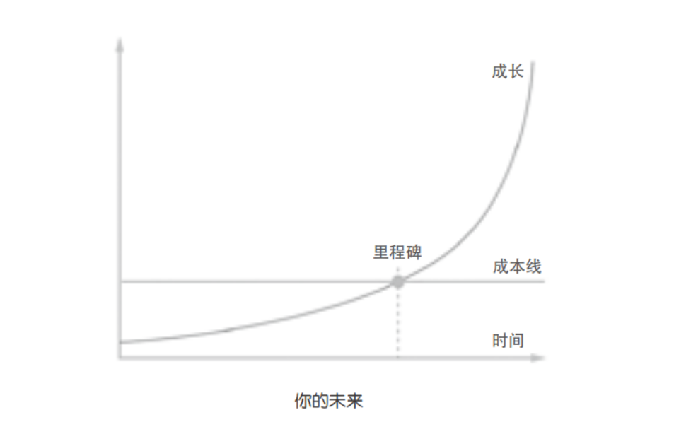

## 14.你活在哪里？过去，当下，还是未来？

如果根基错了，那么在它上面建造的东西再华丽也没有用。

“活在当下”是个世俗中非常流行的建议，这个建议甚至可能曾使很多人热泪盈眶。可若你认真读过上一节，尤其是反复度过那个句子之后：

> 它们被困在永恒的当下……

你还会觉得“活在当下”是个好建议吗？我猜你不会。我猜你会毛孔骤然收紧，猛打几个寒颤，听到脑子里有个声音在说：“我绝对不应该把自己困在永恒的当下！”难道没有吗？（这肯定是元认知能力启动且发挥作用的一个实例。）

> 过去、当下、未来。

有没有办法“活在未来”呢？答案是肯定的：有。事实上，我们不仅有办法“活在未来”，也必须“活在未来”。对，就是必须，否则没有出路。因为“活在当下”就是“永恒地”被困住，“活在当下”就相当于“永恒地”被困在更差的地方，所以，即便挣扎，也要“活在未来”，哪怕“部分活在未来”。

怎样“活在未来”呢？其实，这个词听起来有多玄妙，做起来就有多简单：

> ▷你现在对未来有一个预测。
>
> ▷那个预测需要经过一段时间才能得到结果。
>
> ▷你现在已经笃信你的预测是正确的。
>
> ▷你提前按照那个预测的结果去行动、选择、思考。
>
> ▷时间自顾自地流逝，而你终将走到那个结果出现的时刻。
>
> ▷最终的事实证明，你的预测是正确的。
>
> 由于你提前按未来正确的结果去行动、选择、思考，所以，在相当长的时间里，你生活中的一部分就是“活在未来”的。

“预测”是只有少数人能最终掌握的能力。理由之前也说过：大多数人其实不肯放弃100%的安全感，不肯放弃全视角，从而无法长期、深入地关注和思考任何问题。于是，别说“预测”了，他们不仅没有“过去”，也没有“未来”，甚至连“当下”都没有。仔细想想，“当下”这个概念并不是独立存在的，实际上，它要相对于“过去”和“未来”才有意义。因此，更准确地讲，他们其实“只不过就那样存在着”而已。

我们先看一个很简单的预测：

> ▷从长期来看，脑力的产出率一定比体力的产出率高，且高出许多个量级。
>
> ▷体力增长的玻璃顶很明显，脑力增长的玻璃顶不知在何处。
>
> ▷体力衰退的时间来得很早，脑力衰退的时间来得晚很多。
>
> ▷通过暴力可获得的暴利正在减少，因为从大趋势上看，一定是知识才更可能产生更大的暴利。

也许你会想：现在这不是明摆着的事儿吗？这算什么预测啊！

这是20世纪80年代中期，我还在度初二的时候，在日记本里写下的内容（措辞稍微做了调整）。那时的我，天天泡在延吉市青少年宫，摆弄那台只能跑BASIC编程语言的R1计算机。

许多年后再看这些记录，我当然知道它们算不上什么“惊为天人的大智慧”——实际上，这些话都不是我想出来的，而是我从书籍和杂志上看到的。整个20世纪80年代，媒体的主流论调是：

> ▷知识就是力量。
>
> ▷科技就是生产力。

我当时甚至并不在意“知识就是力量”到底是谁的名言，也没有纠结过“power”这个词究竟应该指“权利”还是“力量”，只是想来想去，认定这个道理是对的，一定是对的，于是**笃信**。

既然我相信这个道理是对的，那么即便当时看不到特别明显的效果，我也能猜得出，在未来——也许是不远的未来，也许是很远的未来——那效果一定会明确而显著。

该怎么办？不管别人怎么说，只要我**笃信**这个道理，就**只能**按照这个道理指引的方向及方式行动与生活。经过这么多年，我知道有多大比例的人认为这个道理只不过是个大道理，太空泛，完全没有实际操作指导意义，可在我看来，这种东西才是最实在、最具体、最值得认真对待的——个中差异，容我细细道来。

2005年，我读史蒂芬·列维奇（Steven D.Levitt）的*Freaconomics*(中译为《魔鬼经济学1：揭示隐藏在表象之下的真实世界》)，其中提到，纽约的黑帮现在已经赚不到多少钱了，同时要冒很大的生命危险。我哑然失笑，想起我陆续认识了很多游戏行业的“大咖”，了解了他们的生活，于是又经常慨叹：那些黑帮成员要是知道“90后”程序员能靠写游戏赚钱且生命无忧，估计都得羞愤得七窍流血吧。

许多年后，再想起这件事情，我的体会是：

> 在知识积累这个方面，在过去的许多年里，我确实做到了“活在未来”。

因为许多年来，我一直在用知识赚钱。讲课、写书、投资、创业，都要靠知识——不断习得、不断改进、不断积累才能产生意义的知识。实际上，这一点不仅有很多人做到了，还有很多人比我做得好。

这只是生活的一部分，剩下的大部分，尤其是“肉身”，当然是一直（也只能）“活在当下”的。所以，我们所说的“活在未来”，从本质上看，只能是“思维上的活在未来”。用之前你还不能直接理解的措辞来描述就是：

> 让你的元认知活在未来。

我可以再举一个例子，是我在2016年8月之前对未来作出的预测。

经过2014年一整年的思考，到2015年上半年，我大致得出了如下结论：

> ▷互联网上貌似已经消失的各种社群一定会卷土重来。
>
> ▷新生代社群的数量肯定会超过上一代社群的数量。
>
> ▷在新生代社群中，免费的社群很可能逐步被收费的社群超越。
>
> ▷以交易为核心的分享（社交）将逐步超越以信息为核心的分享（社交）。
>
> ▷可能成为社群壁垒的应该是收费和内容积累。

于是，我开始对身边的朋友说：“收费时代来了，社群会逐步重新火起来……”说了很久，搭理我的人其实没几个——真的没几个。于是，反正闲着也是闲着，我于2015年8月开通了微信订阅号（当时很多人都在说，“微信的红利期已经过去了”）。到2015年10月底，这个微信订阅号积累了大约4万个订阅用户。2015年11月，我开始动手搭建各种收费社群，也帮身边的一些朋友设计和搭建，甚至组建了一个团队，开发了一个可以作为社群工具的“基础设施”，“新生大学”就相当于一个样板间——谁有本事建一个社群，我就给谁“复制”一份，大家合作创建和运营收费社群。

这一切的思考与行动都是公开的，有兴趣的读者可以去翻阅我的微信订阅号“学习学习再学习”。我不太喜欢一有想法就好像特别了不起似的，总是藏着掖着，我总觉得可以言无不尽，反正我天天都在琢磨未来，有无数的“进一步思考”。

再过一两年，当收费社群成为常态的时候，相信大家就能认同我这个观点了。于是，在这个层面上，我又一次做到了“活在未来”。

2017年5月，比特币价格大涨。我看到的是什么？

> ▷比特币的总流通市值达到270亿元。
>
> ▷包括比特币在内的各种区块链资产的总流通市值达到520亿美元。
>
> ▷尽管比特币的市值依然涨势迅猛，但它在区块链资产总市值中的占比正在下降，已经接近50%。

于是，预测既简单又清楚：

> ▷在未来几年里，区块链资产流通总市值可能会达到非常惊人的程度。
>
> ▷其中，比特币之外的区块链资产总额占比可能会超过80%甚至90%。

那么我应该做什么呢？

> ▷寻找并投资其他高质量的区块链资产。

事实上，这个预测是我在2016年7月投资若干区块链创业公司时作出的，那时比特币在区块链资产总市值中的占比已经低于75%了——我必须用我的行动去配合我那“活在未来”的元认知，不是吗？结果，在不到1年的时间里，预测已经成为趋势的开端。

**请千万注意**：我的预测不一定正确。事实上，我知道自己预测成功的历史数据并没有多好看。但“不确定性”是不可消除的，于是，我只能按照逻辑行事。我只是尽量“活在未来”；反过来，有的时候，我会一不小心“活在错误的未来”。可那又怎样？反正我这种人早就放弃了“追求100%的安全感”。

这幅图又来了！

如果这就是你的未来，那你要从现在开始就“活在未来”。拿出纸和笔，罗列一下：“活在未来”的你，有什么事情是必须做的，有什么事情是绝对不能做的？

又，“活在未来”这件事，一辈子哪怕只做到一次，就很开心了，就会有不可想象的收获了。可问题在于，一旦开启了这种模式，有过一次成功的经验，后面就肯定停不下来了——“做到”变得越来越容易，越来越自然。至于你的思维——只能“活在未来”了。

读到这里，请暂停一下，认真写出下面这个简单的问题的答案：

> 你曾经作出的最重要的正确预测是什么？它为什么这么重要？

也许你写不出什么——很正常，绝大多数人都是这样的。但你要明白，你需要做出一点改变了！

[**返回目录**](./menu.md)
