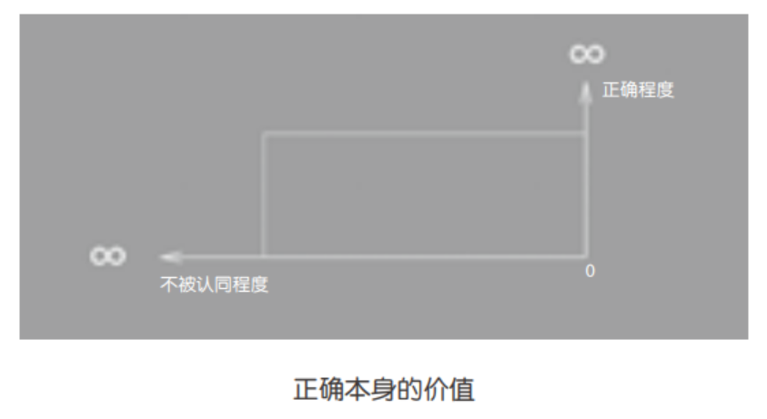

## 16.做得正确就会有好结果吗？

相信我，大多数的痛苦都是幻觉——只是一时的感觉，而非永久不变的真相。

绝大多数从高处跳下自杀的人，很可能不是摔死的，而是吓死的。若在落地的瞬间心脏仍在跳动，那么，由于血压依然存在，其场面大抵是“血花四溅”的……可实际上，大多数尸体甚至没有血迹——在落地之前，心脏早就停止了跳动。

在跳下去之前，“这世界跟我半毛钱关系都没有”的感觉是那样真实，以致“迈出那一步跳下去”的行动显得那么“义无反顾”。可自由落体在着地之前都有一定的运动时间，所以在面临死亡的时候，大脑会进入一种高度兴奋的状态。很多生还者都用类似的语音描述了他们的经历：那不是“瞬间”，而是“很长时间”，在那个过程中，对一生中重要事件的记忆都被唤起，就像在观看一个清晰而缓慢播放的幻灯片。

结论是什么？结论是：这世界一直跟自己有这样那样的联系，而且是相当重要和清楚的联系，刚刚的“这世界跟我半毛钱关系都没有”的幻觉最终被证明为子虚乌有……可是——来不及了！已经掉了下去，马上就要着地了!

事实上，人们不应该为“这世界跟我半毛钱关系都没有”这种幻觉而烦恼。不妨反过来看看：

> 这世界本来确实和我们一点关系都没有，可是我们一路走来，无论如何都会在这世界上留下痕迹，无论如何都会与这世界产生这样那样的联系。至于那联系是否足够强，是否足够有意义，其实取决于我们的行动，而不是我们的恐惧。

作家毕淑敏在某大学举办讲座的时候，有个学生问了一个“终极问题”：

> “毕老师，生命的意义是什么？”

毕淑敏先生的回答是：

> “人生本无意义，意义是活出来的吧？”（大意如此。）

深以为然。也很庆幸，我20来岁的时候在某本杂志里就读到过这样的观念。

排在第二名的痛苦，和排在第一名的痛苦一样，无疑是个幻觉。为什么这么说呢？因为很少有人认真想过这件事：

> 正确本身，其实很可能没有价值。

大多数人习惯性地“一根筋”，只进行单维度思考，从来不去思考事物的另外一个维度。

|            | 别人都是正确的 | 别人都是错误的 |
| ---------- | -------------- | -------------- |
| 你是正确的 |                |                |
| 你是错误的 |                |                |

若你是正确的，与此同时，别人也都是正确的，那“正确”本身的价值其实并不大。

若你是错误的，别人都是正确的，那会是个很可怕的局面。

若你是正确的，别人都是错误的，这时“你的正确”才具有很大的价值。英语中有一个词“contrarian”,原意是指股市中那些倒行逆施（这里仅取"倒行逆施"这个词的字面含义）的人。“特立独行”本身的价值和“正确”本身的价值一样，并不算大，但“特立独行且正确”的价值就是巨大的了。

所以，若我们从两个维度来思考价值，结果就相当清晰了：

也就是说，你正确的程度越大，与此同时，不认同你的人越多，你的价值就越大。若你很正确，但与此同时，所有的人都很正确，那你的价值其实可能等于零。

例如，现在你看好VP/AR，大家也都看好VR/AR，你去做这方面的创业，其实胜算并不高。因为大家都看好，都想做，所以，谁的资源最强，谁就最可能成功，而“你看对了”这个事实本身不会格尼带来哪怕多一点点的相对优势——在“正确程度”这个维度上，你不一定比别人“更正确”，没准儿别人在“正确程度”上超你一大截呢。

所以，若你确定自己是正确的，而你身边绝大多数的人并不认同你的想法，那你应该高兴（而不是痛苦），而且是“越不被认同越应该高兴”才对。所有的人一生都声称自己在寻找价值，可当绝大多数人“不小心”找到真正的价值时，他根本就不知道自己找到了——不仅不知道，还要不高兴，甚至痛苦得要命——真是邪门儿！

为什么人们在面对真正的价值时会如此痛苦？因为他们衡量正确与否的方式错了——他们靠的不是逻辑和独立思考，而是“认同的人是否足够多”。

从底层看，有个重要的因素在起作用：

> 绝大多数人是“表现型人格”，他们在乎的不是好、坏、对、错，他们只在乎自己是否“显得好看”。

“表现型人格”决定了“随大流”的根深蒂固——只有“跟大家在一起”、“与大多数人相同”才觉得安全。

在2003年的时候，几乎全中国的人都认为通过TOEFL考试至少需要掌握12000个词汇——反正大家都这么说。我做了个统计，发现其实在掌握部分中学英语词汇的基础上，再搞定2142个词汇就够了。

我知道自己统计结果是正确的的，我也知道认同我的人并不多，于是，我知道在这里可以挖掘出价值了——《TOEFL核心词汇21天突破》到现在卖了"两辈子"，而且还在卖……

在2007年的时候，我琢磨着：所有讲时间管理的书都错了，因为时间不可管理，可管理的是自己或者团队里的人。于是，我写了《把时间当作朋友》——大家都知道。

在2011年的时候，我花了相当长的时间去研究比特币。在最初的时候，我当然跟所有人一样一头雾水，但我有精读和研究的能力，更重要的是，我有“读不懂但可以读完，然后反复读，进而读得更懂”的能力。于是，我渐渐得到结论：这件事是对的。然后，我开始向身边的聪明人咨询，并和他们讨论，结果是：认为这件事靠谱的人比例极低，而在这个比例极低的人群中，肯用实际行动去验证它的价值的人比例超级低。

我在新东方工作时的同事铁岭曾经告诉我一个简单的原则：听大多数人的话，参考少数人的意见，最终自己作决定。这是个很睿智的原则。在这里，“听大多数人的话”，不是“按照他们那么说的那么做”，而是“听听他们怎么说，琢磨他们怎么想”。我的结论是：第一，比特币这件事是对的；第二，认同“这件事是对的”的人很少，所以这一次“我的正确”很可能价值超级大。于是，我没有把时间花在说服他人上，只是在博客上写了一篇文章——《此物一出天下反》，然后就去做自己该做的事情了。

在2015年年初的时候，我又一次认为自己想对了：“在互联网上，免费时代过去了，收费时代来了。”我把这个结论告诉身边的朋友，结果呢?我说了大半年，大家都是客客气气地听，也不反驳，但就是不去做。

本来已经准备“退休”的我，想了想：算了，还是我自己来吧！因为我再一次意识到，这是一个“特立独行且正确”的机会，价值很大，所以“不去做”对我来说是无法忍受的。从另外一个角度，我知道这样的机会实际上并不多，一辈子遇到一次都已经是极度幸运的了，所以我只能去做。

于是，我开始行动。后面的事情大家都看到了：2015年8月中旬，在大家都说“微信的红利期已经过去了”的情况下，我开通了微信订阅号，在积累了一段时间之后，从2015年11月开始，我自己创建并帮朋友创建各种收费社群，制作并指导制作各种收费内容；2016年7月，我在“得到”上开通收费专栏《通往财富自由之路》，不到1年有超过15万人订阅。到了2016年的最后一个季度，国内各大平台都开始做付费内容订阅了。

请注意：尽管你“特立独行且正确”，但这并不保证你一定有机会验证和收获期价值。

在2013年年中的时候，过呢的所有比特币交易所机会都来找过我，给我很优惠的条件，让我加入或者投资——我全都拒绝了。直到今天，我都认为自己当时的决定是正确的：想要在去中心化的世界里打造一个最大的中心，这仅从逻辑上就站不住脚。

可结果呢？这些我没有加入或投资的交易所的估值在接下来的两三年里不知道涨了多少倍——我被反反复复“啪啪啪啪”地“打脸”。而与此同时，按照我认为正确的逻辑打造的开源交易所公司的增长极其缓慢——我还是被“啪啪啪啪”地“打脸”，左脸之后是右脸……因为风险投资机构从来都是最看好交易所模式的，而他们的资金实力远比我个人要强，所以在这次博弈中，我几乎没有胜算（虽然在一两年之后，貌似出现了一点时来运转的苗头）。

这时就需要真正的勇气了。若这世界格尼正反馈，你能心平气和地接受，不因此趾高气扬；相反，若这世界并没有给你正反馈，甚至给出你负反馈，你依然能心平气和地接受，不因此灰心丧气——这不是勇气是什么？

“特立独行且正确”终究是很难做到的事情。当然，一切真正有价值的事情都很难做到，否则，价值就变成任何人都可以随随便便实现的东西了。

回头想想，我在20多岁的时候是完全不懂这个道理的（实际上也没有人能给我讲清楚），所以，我当然经常会因为在自认正确的同时不被认同而痛苦，也会因为痛苦而做出很多“走形了”的事，进而吃了很多当时就能理解的明亏，以及很多多年以后才反应过来的暗亏……

随便举个例子：那些在课堂上挑刺儿的学生，虽然很聪明，但实际上是吃亏的——“证明自己正确”并不是学习的任务和目标，“时时刻刻成长，早晚更聪明、更正确”才是应该的结果。他们吧注意力用错地方了，以致没有获得原本应该获得的结果。这可能是很多人一生中吃过的最大的暗亏，也是他们从来都不知道自己吃过的暗亏。

许多年后，我虽然有机会和这么多人分享自己的经历和成长过程，却常常在想：将这些“事后”（许多年以后）才弄明白的道理传递个那些尚无经历的人，难度其实是非常大的，不仅要把事情说清楚，还需要对方拥有强大的想象力和元认知能力——元认知能力是一切反思的基础，可大多数人本来并不知道元认知能力是什么！

然而，毕竟大多数人进行过足够的阅读训练，元认知能力又是一种只要获得就不会消失的能力，因此，终究有一些人因为这篇文章而改变。他们会懂得：有些痛苦其实只是幻觉；有些价值，之前之所以不可能获得，完全是因为自己“有眼不识泰山”。

还好，我们升级了。