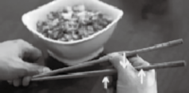

## 28.你想不想要一个人生的“作弊器”？

一个人的学习能力，其实就是一个“外挂”——天生条件之外的“装备”。想想看：如果一个人需要什么就学会什么，这简直就是自带“作弊器”啊！随后，这个人拥有的可是“开挂的人生”！但是很可惜，绝大多数人在这一生中一直处于装备不全或者落后的状态，又何谈“开挂”？

随着时间的推移，绝大多数人会为自己的确“技不如人”而苦恼——谁没有一颗上进的心呢？我觉得每个人都有。不过，仅有一颗上进的心是没用的——绝大多数人穷尽自己的一生，用自己的生命惨烈地证明了这个简单的道理。

学了一辈子（准确地讲，是“想学”了一辈子），最终却连基本的学习能力都没有，这才是终生原地踏步的根本原因。那么，我们所说的学习能力究竟是什么呢？又，如何才能判断自己学习能力的强弱呢？显然，学历并不说明问题。人类史中所有的社会在教育上都不成功——这并不奇怪。

其实，我们可以用一种很简单的方式来判断自己学习能力的强弱。学习能力的进阶，无非包括以下3个阶段，或者说，处于不同阶段的人，会处于不同的境界：

> - 第一个阶段：能学会有人手把手教授的技能。
> - 第二个阶段：能学会书本上所教授的技能。
> - 第三个阶段：能学会没有人能教授的技能。

从这个角度来看，绝大多数人在第一个阶段就不合格，因为他们在相当长的时间里，连那些有人手把手教授的技能都没有学会，没有用熟，没有精进。别掉以轻心，你如果看看身边有多少人连用筷子这么简单的事都一辈子学不会就能明白了。使用筷子一定是一项有人手把手教过的“技能”，可结果呢？这样的例子还有很多。例如，用笔写字，好像所有的人最终都学会了，但事实上呢？很少有人通过刻意练习让自己的字足够好看，不是吗？

许多年后，大多数人终于反应过来：“有人手把手教授”是一件多么幸福的事啊！可惜，当年幼稚、无知，越是有人手把手地教，就越逆反，就越不愿意学，如果把自己逆反成了一个笨蛋，一个只会偶尔后悔却完全不知道下一步该怎么做的没人理的笨蛋。

若你在成年之后竟然还能获得别人“手把手教授”的机会，请一定要珍惜。什么叫“珍惜”？“珍惜”的意思是，在这个过程中，一定要认真观察，认真思考，反复琢磨：

> - 这个技能的重点在哪里？
> - 做得好的人为什么能做得好？
> - 做不好的人为什么做不好？
> - 还有哪些地方可以改进？
> - 有哪些刻意练习是必不可少的？

“学会如何正确使用筷子”其实还真是个特别好的例子，值得反复审视。现在有两种情况：

> - 你知道自己确实不会使用筷子。
> - 你知道自己能够正确使用筷子。

若干你不会使用筷子，接下来就要看你有没有办法进入学习能力的第二阶段了：通过读书、读教程来学会一项技能。如果你确定自己能够正确地使用筷子，那你现在可以尝试进阶半步：看看自己有没有能力教会别人正确地使用筷子。

我在网上找了找，最好的筷子使用教程居然（其实也很自然）是老外写的。发表在wikiHow上^[1]^,里面既有文字讲解，又有视频示范。先看看自己能不能学会，或者想象一下，若你要教别人（例如自己的孩子）使用筷子，你应该如何去做？关键在哪里？为什么看起来那么简单的事情能难住三分之二以上的人群？

多年来，我经常以这件事情为例来证明：

> 很多事情，即便非常简单，都有可能难住一些人一辈子。

这件事还能证明：

> 这么简单的事情，绝大多数人竟然不会教，甚至连自己的孩子都教不会，只顾着在那里发脾气——而后，无可奈何。

如果能够仔细观察，最终找到重点的话，基本上是教的人两分钟就能讲明白，学的人五分钟就能学得会，然后摆脱一辈子的尴尬。

使用筷子

使用筷子有以下两个关键点：

> - 在两根筷子中，下面那根一直处于静止状态。
> - 张开和夹住的动作，其实来自上面那根筷子的移动。

最为关键的是：如何让下面那根筷子处于稳定状态？

> - 下面那根筷子和手一共有3个接触点，以两端为支点。
> - 用拇指的根部中间压住筷子；无名指其实是反向用力顶住筷子的。
> - 大多数人败在无名指的用力方向上，如果把这个方向搞对了，那么下面那根筷子就稳定了。
> - 花几分钟练习如何用大拇指和食指控制上面那根筷子并夹住东西。
> - 反复练习，从笨拙到熟练的过程从本质上看是大脑建立新的沟回的过程。

那些之前就会用筷子的人不妨对比一下，你教别人使用筷子的方法、路径、重点和我讲的一样吗？如果不一样，你教授的内容比我的更有效吗？如果你教授的内容比我的更有效，不妨教教我，我也想有提供效率的机会。许多年来，我在教别人如何学习的过程中，顺带帮助很多成年人“突然能够正确熟练地使用筷子这个神奇的东西”。

半数以上的人不会用筷子。这说明什么？这没准儿能够说明：

> 这世界上有半数的人，即便有人手把手地教，也学不会，只因为他们不动脑子。

在这么小的事情上都不动脑子，其他事情就不用提了。

所以，想象一下吧：若无论什么都需要别人手把手地教，那在这一辈子中获得进步的可能性得有多么小。第一，那些会了的人并不一定有时间（几乎是肯定没时间）教。第二，前面也讲到了，绝大多数会的人其实真的不会教，他们有时也懒得动脑子，所以不知道关键点在哪里，即便是好心想教（例如教自己的孩子使用筷子），也教不明白。

这就是你必须想办法进入第二个阶段（即，能学会书本上所教授的技能）才有可能大幅进步的根本原因。虽然书籍和教程也有质量差异，但这就是考验你的能力的地方：

> - 你有没有心思去寻找、阅读大量的相关书籍和教程。
> - 你有没有能力去甄别书籍和教程质量的好坏。
> - 你有没有能力在实践中运用书籍和教程所传授的知识。

很多人因为没有耐心，甚至干脆没有动力，所以永远无法进入第二个阶段。还有很多人，虽尝试着进入第二个阶段，但不知道判断标准和依据（例如，很多人根本不会选书，他们选书的方法只有一个，就是找人索要书单），于是，不知不觉走了太多弯路，以致事倍功半。而剩下的少数人中的多数，因为没有执拗地践行书本所教授的有道理的知识，最终只不过做了无用功。

读到这里，你就能明白善于学习和学习能力强的人有多难得了。

可这还不算完，因为若不能进入第三个阶段，那你依然只是“略胜半筹”而已，无法达到甩开别人的地步。你可能不知道的是，别看大多数人的学习能力比较差，但模仿能力还是很强的，所以，他们只要看到你能做到，就很可能迅速模仿个八九不离十，甚至整个国家都可能是这样的（例如，日本最初就是通过模仿在一些领域超越欧美的，深圳的“山寨”精神其实也是这种能力的表现）。于是，你好不容易学来的东西，别人靠模仿就做到了——你很难把别人彻底甩掉。

真正让你变得卓越的，是你必须走入的第三个阶段：

> - 你不仅能学会没人能手把手教你的东西；
> - 你甚至能学会连书本中都找不到的东西。

不用深入探讨，你已经能明白，若做到了这一点，你基本上就“无敌”了。关键在于，若做不到这一点，你就会时时刻刻被模仿者跟随，甚至被模仿者超越。所谓“微创新”，不也是一些“大佬们”所推崇的能力吗？这真的不是“吐槽”，这是在陈述事实。

要走入第三个阶段，实在是太难；要教别人走入第三个阶段，不是不可能，但也确实很难——绝大多数人没有足够的能力去理解第三个阶段的重点。若非要简单说说，也不是不行，能理解多少就看你的了。如果只看字面，以下的关键点就好像是每个人都会做的事情一样。

> - 确定自己有强烈的欲望去搞定这个技能。
> - 寻找最少必要知识，反复问自己：这件事最关键的地方在哪里？
> - 马上开始运用；马上开始践行。
> - 相信自己一定能学会；相信自己一定能通过践行获得进步。
> - 通过记录，量化自己的刻意练习进程。
> - 不断总结，不断整理，不断让那些新技能、新概念在自己的脑子里形成清晰的组织与关联。
> - 绝对不要和笨蛋斗气，要珍惜自己的时间和生命。

如果你是一个终生学习者，那么在30岁之后，你会经常觉得不好意思，因为你总会发现过去的自己实在是太笨了。如果你有机会教别人高中数学或者物理，就会发现：这么简单的东西，多年前我在忙就觉得那么难呢？其实，这是学习能力进步造成的错觉——在那个时候，那东西确实就是那么难。

每一次，当你的认知进步之后，你就会发现“不同物种”之间的区别及那个区别的形成原因。总是有很多人说：“读那么多书有什么用？！”这是为什么？因为他们那个物种从来就没有能力从书里学到些什么，他们是在第一个阶段就不及格的物种。但是，无论有多少人认为读书无用，也总是有另外一些人在不断地读书，他们是早就“能学会书本上所教授的技能”的物种，手把手地教对他们来说很可能并不高效。当然，人群中还有一群“一声不响”已然成为高手的人，他们显然是打通了“第三关”的新物种。

我想，在我的人生中，比特币可能会成为我最感激的东西。也许人们会认为：“拿东西让你发了财了嘛！”我不否认这一点，但长期以来我内心更感激的是另外一个别人可能完全不在意的点：

> 他给了我一个学会“完全没有人可以手把手地教授”、
>
> “完全没有书籍系统地阐述和教授”的东西的机会。

2011年，几乎所有的人都觉得这事儿太离谱了。那时，没有任何一本关于它的书，甚至连有点质量的文章都没有，只有一个匿名者（Satoshi Nakamoto）发布的白皮书，涉及数学、加密学、拓扑学、金融学、编程、分布式运算、芯片涉及、网络管理（事实上还隐含着政治学、社会学、心理学）等方面的知识，但其中没有任何一方面是我的“专业”——要知道，我在大学里的专业是会计！

也就是说，在随后的“一辈子”（七年就是一辈子）里，我相当于“自修”了“大学”的可能，在金钱和好奇心的刺激下，一路狂奔，步步高潮。几年下来，我已然变成了另外一个人（虽然相貌只是变老了而已），甚至连我一直在用的“我进化成了另外一个物种”的说法也来自这段经历。正如毕淑敏先生让年轻时的我明白的那样：“我知道人生本无意义，但，这段经历生动地告诉我，若你能把生命中的一段变得与众不同，那自己的人生意义依然非凡。”我怎么能不感激这个“起初看起来完全不靠谱，后来看起来意义非凡”的家伙呢？

幸亏在此之前，我已经在学习的第三个阶段摸到了一些门道。如果我还处在第一个阶段，那么即便我很早就看到了比特币这个东西，这个东西也根本不会在我身上发生任何奇迹。如果我还处在第二个阶段，那么我可能要到2016年之后才有能力懵懵懂懂地通过几本书对它了解个大概。

下面是我第一次经历“学会完全没有人教授的东西”（第一个阶段不够用了）、“书有很多但是看不懂”（第二个阶段有点用处，但需要挣扎）的场景，也就是说，从第二个阶段走向第三个阶段的过程中发生在自修逻辑的时候。

在26岁那年，我突然发现自己的逻辑很差，事实上我并不像之前自己以为的那样“并不笨”。事情是这样的：在某个阳光明媚的下午，我前后见了两个人，分别被他们的观点震惊了，也分别被他们“说服”了，可是到了晚上，我惊讶地发现，他们的观点竟然是截然相反的！他们之中只能有一个是对的，可是，我竟然在几个小时内分别被他们说服了，还完全没有发觉！

我被吓坏了。第二天，我冲今图书馆，开始找书。找到“thinking”这个类别之后，我发现了一个之前完全不知道的概念：criticl thinking。在这个类别下面，全都是讲如何正确思考的书。于是，我挑了几本由著名出版社出版的、再版和重印次数比较多的书来读。其中，Beyond Feelings:A Guide to Critical Thinking成了我的最爱。而最终，这本书也成了我的“人生启蒙书籍”之一。

细心的你可能已经注意到了，最基本的“选书方法论”不过是“选择由著名出版社出版的、再版和重印次数比较多的书”。再观察一下身边的人：这么简单的事情他们从来都不知道，以致许多年来用来“喂脑子的饲料”全是劣质，于是终生吃了很多亏且不自知——可怕。方法论这东西，无论多么简单，都至关重要。

然后，你就会发现，虽然梳理说的很清楚，但实践起来并不容易。更为重要的是，没缘分能教你进阶，甚至不可能有人愿意教你进阶。别说没人教你了，你甚至根本找不到一个能够心平气和地与自己讨论问题的人，因为凡事只要逻辑足够严谨，就很可能引发绝大多数人的反感——谁愿意被证明想错了？谁愿意承认自己不会思考？谁在自己被证明思考质量差的时候不会恼羞成怒?甚至，在我主动和几个格外亲近的朋友深入探讨问题时，也差点吵翻（在那个时候，我年轻，他们也年轻，我们都有很多不完善的地方，也不命吧理智才是最好的情绪）。挣扎了好几年，我才反应过来：逻辑严谨、思考缜密、研究深入，只能靠自己实现，只能完全由自己操作，就连讨论都是耽误事儿的。

所以，回顾一下之前提到的我的好朋友铁岭说过的话：

> “听大多数人的话，参考少数人的意见，最终自己做决定。”

第一次听到这句话的时候，我的直觉反应是：“高手就是高手！你看，他直接忽略了那个人们以为很重要，却最没用、最耽误效率的‘讨论’……”

到这里为止，我不仅告诉了你我走过的3个节点，还告诉了你我是如何跨越每个节点的。不过，我仍然没有办法告诉你到底应该如何完成“你自己的跨越”，因为每个人的路径很可能是完全不一样的，适用于我的不一定适用于你。然而，还是有一条真理存在：

> 你必须自己琢磨出自己的路径和跨越方式，而这恰恰是判断你能否进入第三个阶段（或称“境界”）的依据。

后面讲到投资的时候，你就会明白，对“自己的路自己走”这么简单的句子——首先，深入理解它并不是一件简单的事；其次，它是投资的终极原则之一；最后，也更为重要的是，它看起来简单，做起来难上加难。

只要在第三个阶段有过哪怕一次成功的经历，你就“开挂”了。你会发现：没有什么是你不敢学的——很幸福；没有什么是你学不会的——更幸福；在学会的东西里没有什么是你练不好的——不能更幸福了。

----

[1]http://www.wikihow.com/Eat-with-chopsticks