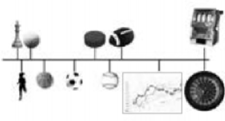

## 31.你生命中最值得拼死守护的究竟是什么？

技能就是一个人的装备，每多一件装备，人就强大一些，所作所为就会在一个更高的层面上。很少有什么技能是“闲技”，只要它能与其他技能结合起来，就会形成“多维度竞争力”。尽管琴、棋、书、画被普遍认为是“闲情逸致”，但仔细想想就会知道，精通这些技能的人，若把其背后的思维模式拿出来做别的事情，一样是高手，甚至“一上来就是高手”。做事的节奏感，看事的大局观，“攻城略地”的战略与战术……哪一样不是相通甚至相同的呢？20世纪70年代出生的人（例如我），在长大的过程中都听说过英语的重要性，也都学过英语（只可惜，学了十几年，可能连门都没入）。绝大多数人从一开始就认定“其实学了也没什么用”，也有不少人将信将疑地“学”了一阵子，最后得出“我没有语言天分”的结论，反正到最后，只有极少数人能真正精通。可事实上，英语这东西用不着“精通”，只要够用就行。后来呢？20世纪70年代出生的人，在20世纪90年代大学毕业，那时没有人能预见：

> 再过10年，全国人民都有机会出国旅游！后来，当他们自己也有机会出国旅游时，却发现“只能跟团走”。为什么？因为他们单词不认识几个，半句英语都说不出来，若自己出去就是瞎子、聋子、哑巴……

可是，后悔已经来不及了。时间在惩罚愚蠢者的时候，只会毫不留情——这也是绝大多数人面临的尴尬。

市面上有很多书，书名模板是“……从入门到精通”。这类书大都很畅销，换句话讲，就是购买这类书的人不少。可实际上，坊间有一个戏谑的说法，说这种书其实是“标题党”，真正的书名模板应该是“……从入门到放弃”。那么，这到底是作者“标题党”的问题，还是读者自身的问题呢？

答案非常肯定：不是作者“标题党”的问题，而是绝大多数读者的问题。为什么？因为就是有一些读者真的按照书中的内容学会了、学好了、精通了。尽管这些读者是少数（甚至是极少数），可问题在于，在任何技能上，从来都只有极少数人能达到精通的境界，而能技压群芳的人从逻辑上讲必然是极少数人中的极少数。古今中外，概莫能外。

终究有些人走到了最后，可更多的人究竟错在哪里（或者说，究竟差在哪里）？

一个最基本的原因在于：

> 他们低估了学习任何一项技能所需要的重复联系次数。

重复，是从笨拙到达熟练的唯一通路。卖油翁所说的“无它，唯手熟尔”，用今天的神经科学属于解释，就是“通过大量的重复动作，最终使大脑中两个或者多个原本并无关联的神经元之间通过反复刺激而产生强关联”。至于需要重复多少次，因人而异。而关于“建立一个好习惯需要……天”的说法，事实上是站不住脚的，因为这件事没有通则，就是因人而异的。另外，需要重复的次数也和基础有关。同样是从头开始学弹吉他，练习指法，钢琴师和建筑工人建立同样模式的“神经元关联”需要的重复次数肯定有天壤之别。

现在有很多人都会开车。在从开始的笨拙达到后来的熟练（开车这件事，对绝大多数人来说根本用不着“精通”）的过程中，所有人都一样，能够体会到大脑的神奇力量——到最后，大脑已经把方向盘、刹车和油门（现在我开特斯拉，就没有“油门”了，只有“电门”）“内化”成具体的一个“器官”。

当需要左转的时候，你完全是靠“条件反射”完成动作的——瞟一眼反光镜，踩刹车减速，将方向盘以合适的速度转到合适的位置，转弯完成后略微松开方向盘，让它自己回轮，当车头方向摆正的时候，再次下意识地握紧方向盘，右脚早已恰当地从刹车处松开，踩到了油门（或者“电门”）上，慢慢加速……在这个过程中，方向盘就好像长在你的手上，刹车、油门就好像长在你的脚上——完全是一体的。

任何工具都一样，一旦我们能够熟练地使用，他都会被大脑“内化”成身体的一部分。与此同时，在大脑里，一些原本不存在的神经元关联形成并固化，直至无法消失。

更普遍的例子是手机上的虚拟键盘。事实上，在移动电话被智能化，且普遍采用大屏幕之后，手机早已程磊所有人的“器官”之一（人们丢手机的频率普遍下降，其实原因是现在的人“机不离手”）。在刚开始的时候，你也许还要盯着虚拟键盘打字。而现在呢？基本上是想到什么，按出来的就是什么吧。我把这个神奇的现象称为“工具的内化”。

很多人在小时候没有养成兴趣爱好，这是很吃亏的（究竟有多吃亏，他们一辈子都没有机会弄明白）。我自认很幸运，琴、棋、书、画都沾了些边儿。当开始弹吉他的时候，有些高难度的地方，感觉怎么都过不去（请注意：那只是“感觉”而已），就坐在那里生闷气。父亲看到就笑了，他告诉我：把速度放慢1倍去弹就简单了，重复弹很多遍“手指就记住了”。这个说法让我永远都忘不了——不是“就会了”，也不是“就熟练了”，而是“手指就记住了”!

同时貌似“眼睛也记住了”，反正我随手一画，那条线基本上就是卡片上0.618那个比例所在的地方。后来，我到处去找各种尺寸的卡片画着玩……最后，这竟然成了我在同学面前炫耀的资本，算是我的“绝技”，但其实那只不过是不需要茶府训练太多次就能画出来的一条线而已。

当然，那时的脑科学没有今天这么发达，很多科学解释尚未出现，所以没有清楚的概念能解释这种现象。现在已经了然——其实那并不是“手指记住了”，而是“神经元关联通过重复建成并固化了”，从而产生了大脑将我们所使用的的工具“内化”的神奇效果。

除了低估重复必要次数之外，有一个更深层次的原因使人们半途而废：

> 低谷任务的复杂程度。

第一，任何一项真正有意义的技能，基本上都是很多技能（或者说“子技能”）的集合；第二，大多数技能若单独拿出来，作用并不大，需要与其他某个或多个技能配合使用，才能“效果惊人”。

这就好像在学素描的时候，虽然只使用一张纸、一支笔，但实际上还需要很多子技能——起码有这么两个：

- 画直线
- 画圆（圆分为两种，分别是正圆和椭圆）

任何一个擅长画素描的人，在最初的几个月里，都要把这3种形状（直线、正圆和椭圆）画上很多次，直到不借助任何工具，单手只笔“随随便便”就能画出标准（或者比较标准、相当标准）的形状为止。如此这般，他们便能随手画出人黑一个集合图形。

当然，他们还需要更多的子技能。他们要研究透视学，他们要研究光影，他们要研究笔触轻重之间的微妙差异……所以，真正困难的不是如何掌握某个单项技能，而是如何在掌握多项技能的同时把他们配合起来使用。

以写作为例。写作这东西，说简单也简单，说难那真的很难。说它简单，是在熟练之后（其实，任何技能在熟练掌握之后，实际上都是简单的）；说它难，很难，是在熟练之前，不仅需要学习并熟练掌握多项子技能，包括观察、思考、表达、沟通、理解他人等，还要恰如其分地使用这些技能，让它们能巧妙配合——你说，写作简单得了吗？

所以，很多人无论学什么都一样，很快就放弃了。事实上，这只不过是因为他们“重复”的次数太少了，所以根本达不到神经元之间建立强关联的地步，当然也没有机会体验那种“内化”的神奇效果。可是，他们为什么总是那么快就放弃呢？很简单：基于种种原因，他们从来没有真正掌握，更别提熟练、精通任何一项技能。

同样，由于之前没有真正掌握，更别提熟练、精通任何一项技能，所以，他们从来都不知道任何一项技能最终都是“复杂的集合体”。于是，他们总是倾向于低估学习任务的复杂程度，总是“拿着苍蝇拍打坦克”（不是“拿着大炮打蚊子”）——失败不就成了在正常不过的事情了吗？

事实上，你只要有哪怕一次学会某项技能的经历就好了。因为在那个过程中，你很清楚自己是如何从笨拙达到熟练的，也很清楚自己是重复了多少次才完成了“内化”的。于是，有过这种经历的人，会“显得”比没有这种经历的人更有耐心。

不过，我觉得在这里用“耐心”这个词可能不太准确，因为对于痛苦，人们大都没有什么忍耐力。被描述为“有耐心”的人，更可能是因为他们能实实在在地看到希望。反之，被描述为“缺乏耐心”的人，更可能是因为他们绞尽脑汁也看不到半点希望。所以，是否“心存希望”才是真正重要的因素。

- 选择题★关于痛苦，以下哪个说法对你的触动最深？

“至少习得（熟练、精通）一项技能”，其实是所有的人在任何技能习得（熟练、精通）道路上的起点，也是他们能够达到终点的根本——有经验，所以有能力、有资格“心存希望”。因此，他们才能忍受自己的笨拙，忍受自己的低下，忍受（或者说“抵制”）各种可能会浪费注意力的诱惑——甚至根本不需要忍受。因为心存希望，所以何必在意成长之外的任何东西呢？

也同样基于已有的经验，他们会有意识地呵护他们心中的希望，因为他们知道那东西实在是太重要了，比生命还重要——如果没有它，生命还有什么意义？

有一次，毕加索在咖啡厅里突然来了灵感，就在餐巾上画了起来。邻座有个女人看到了，觉得他画的真好。几分钟后，毕加索喝完咖啡准备离开。

在他起身打算扔掉那块餐巾的时候，那女人开口说：“能把那餐巾给我吗？我出钱买好了！”毕加索说：“当然可以，那你要支付2000美元。”那女人懵了：“什么？！你画的拿东西不过用了两分钟而已！”毕加索答道：“夫人并非如此，那耗费了我60年。”

下面这段话对我来说，是玩笑，也不是玩笑：

> 我的这本书，不是用笔写的，更不是用键盘写的，而是用命写的，里面的每一个道理，不仅是“我所笃信的道理”和“我实践过的道理”，更重要的是，它们是“因为我已经做到，所以被证明为真正有效的道理”——时间不就是命吗？你说这本书应该卖多少钱？

话说回来，你现在知道什么是最重要了吗？

希望。

让我们重新定义一下“什么是希望”。“希望”的通俗定义很简单：相信明天会更好。在精确一点，“所谓希望，就是一个人相信自己的明天会因为今天的努力而变得更好“。这里的重点是，明天不会自动变得更好。明天之所以能变得更好，是因为今天的行动，是因为今天用正确的方式做了正确的事情。明天是否会变得更好，与今天那笨拙所带来的的不适感（甚至自卑感）完全没关系——只要持续行动，一切都会改善（尽管有运气因素）；反过来看，一旦放弃行动，那么明天100%会变坏，没有例外。

能让你升职的是什么？是“思考”与“行动”。

若我们的生命中真的有最宝贵的东西，那只能是“希望”。他不仅重要，而且最重要——任何人在上下求索之后的结论都是一样的，它几乎是整个生命的意义。然而，希望就像烛光，往往非常脆弱，一阵风就可能把它吹灭。怪谁呢？应该怪自己。所以，它也需要你的守护，你的责任就是无论如何都不能让它灭掉。

那么应该如何呵护这个生命中最重要的东西呢？相信我，无论什么事情都是有方法论的，越是重要的事，越是必然有方法论存在，而且越是必然有更好的方法论存在。

核心理由在于，人们所从事的各种活动有着本质的不同，有一个重要的因素使我们没办法对整个世界“一概而论”。

先来看一张图（插图摘自The Success Equation:Untangling Skill and Luck in Business,Sports,and Investing,Michael J.Mauboussin）。

纯粹依靠技术纯粹依靠运气

[**返回目录**](./menu.md)
