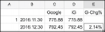

## 35.别闹——没有钱能不能开始投资？

“等我有了钱，就马上开始投资！”这句话的漏洞不仅在于：

> 你什么时候才能有钱呢？万一总是没钱呢？

放眼这个世界，很不幸，那“万一”还真的发生了在了绝大多数人身上。所以，很多人一生都没有投资过，甚至，更多的人连“开始”都没有过——要知道，在“开始”投资的人中，绝大多数也是以失败而告终呢。

其实，之前提到：

> 钱（资金）本身不配被称作“资本”，因为“拿着钱”的人可能没有足够的智慧把自己的“资金”变成“资本”。不是“钱”不配，而是拿着钱的“人”不配站在资本之后。

所以，前面那句话的另外一个漏洞在于：

> 投资不一定要等到很有钱才能做。

投资这件事，真的不一定要等到有钱了才能做，没钱一样可以做投资——这是很多人从来没有想到，也从来没有因其感到震惊的事实。

我们先整理一下思路：

> 在投资这项活动中，最重要的元素是什么？

其实，我早就给出了答案：是投资者的“思考能力”（或者说“智慧”）。资金想要成为资本，需要具备“金额”、“时限”、“智慧”这3个要素。它们的重要程度，按照如下顺序排列可能是最合理的：

> **智慧> 时限> 金额**

为什么金额实际上是投资活动中重要程度相对比较低的因素呢？因为衡量投资成功与否的核心指标，并不是最终赚了多少“钱”（绝对值），而是到了最终，起初那些钱的增长比例是多少（相对值）——增长比例才是更为本质的衡量指标。

另外一个原因是：当身在起点时，“金额”对每个人来说几乎是“无法由自己控制的因素”。若你是“富二代”，你就“直接”拥有了更多的“金额”；若你不是，你可能连“一定的金额”都未必拥有。

然而，“时限”这个东西，对所有人都是公平的，与在起点上的差异无关。我既不是“富二代”，也不是很有钱，但，我想，任何一个正常人，只有“主观上稍微坚定一点”，就可以拿出几千或者几万元，并给这笔钱“判无期徒刑”。只要做到这一点，一个人在投资领域，在“时限”这个维度，就与所有“合格的投资者”及“优秀的投资者”一起站在最高的位置上了——不能再高了。

想明白这个道理，需要的就是“智慧”——一个比“金额”和“时限”更为主观的东西。可这偏偏是任何人都能做到的，这真的是很违背直觉的事情。

> 最难的竟然是最简单的。之所以说它最难，就是因为它太简单了，以至于很多人干脆没想到。

再深入一点，“投资智慧”不大可能通过“遗传”获得（关于这一点，在后面会深入解释）。

所以，把我们的结论综合起来重述，就是：

> 投资活动里最重要的因素是“智慧”，在这一点上，没有任何人又“先天优势”。

在许多年前的那个阳光明媚的下午，忽然想明白这一点的那一瞬间，我大汗淋漓，脑子却格外清醒。抬头，我看见了未来。

这是一个思考过程的复盘。我做过很多年的老师，我知道思考这东西在起步的时候会显得“多么不自然，多么吃力”。上面的思路对读过这本书前面的内容的你来说，显然是“老调重弹”。可我们都已经有了一定的元认知能力，运用元认知能力，我们可以审视自己的思考，再进一步，“高级一点的使用方法”是运用元认知能力去揣摩他人的思考（结果及其过程）。所有优秀的老师，都是这方面的高手（大多数老师其实不合格的原因也在这里）。

既然我们的结论是有3个维度的定义“资本”，那么在任何一个维度上“更进一步”，都是打造多维度竞争力的基本手段。既然在“金额”上受先天限制，既然在“时限”上很容易到达最高点，既然在“智慧”上每个人都没有先天优势——既然“智慧”是最重要的因素，那么：

> 为什么不马上开始锻炼自己的智慧呢？

就算你觉得自己没有钱，也可以开始锻炼自己的智慧。

如何开始锻炼投资智慧？

> 创建一个Excell表格（Mac上的Number或者线上的Google Spreadsheet也行）。然后，设想你用1美元买了Google的股票，在每个月的月底，更新一下股票价格，算出相对最初投资1美元的涨跌幅——完事儿。
>
> 
>
> 
股票价格记录

当然，你也可以跟踪若干个公司的股价变化。不过，建议你不要关注太多，三五个已经足够，否则你的精力可能会不够用——即便是“虚拟投资”。过不了多久你就会知道，“磨练大脑”这件事很实在，一点都不“虚拟”。

你反应过来了吗——开始投资获得条件是什么？竟然只不过是：

> 只要你愿意……

这里有几个要点：

> ▷事实上，你在一开始跟踪的股票是不是GAFATA其实无所谓。如果你英语不好，那么在国内股票市场上选一个你有根据地认为可能会持续成长的企业就可以了，因为接下来，你在闲暇时间要关注这个企业的财报和其他新闻。
>
> ▷金额必须设置成1元——也就是最方便计算且金额最小的单位。事实上，1元、1000元、1000万元，抑或美元或者人民币，都无所谓，不是因为“反正是虚拟投资”，而是因为从一开始就要养成习惯：关注相对值，而不是绝对值——增长比例才真正重要。
>
> ▷每个月只更新1次数据。在每个月的其他时间里，绝对不要去看这个数据。看它不仅没有意义，更可怕的是会让你养成坏习惯。至于那个坏习惯究竟有多可怕，以后你会越来越明白的。（进一步的自我训练是：如果你有一次破例，没到月底就忍不住去看数据了，那你一定要想办法适当地惩罚自己一下。）

很多人都会不由自主地想：“这么做有什么意义呢？”如果你想得出来，你早就做了——你不是一直没做吗？也就是说，以你目前的情况，是不可能想出这么做有什么意义的。

**让你做，你就做，少啰唆。**

因为前提很清楚：

> ▷你想学。
>
> ▷我有经验。
>
> ▷虽然我知道你想不出“这么做有什么意义”，但我猜你起码能想明白“这么做好像什么坏处都没有”。

持续至少12个月，才算是入门——这已经算是非常快的了，以后你会越来越明白这个道理。以后，你会见到无数的人在冲进投资领域的时候，连哪怕一点点的基础训练都没有，以至于他们以为自己冲进了市场，而实际上迈入了赌场。

我想，我已经想办法与你在一定程度、一定范围内建立了信任——假设你每周读这本书中的一节，耐心地、只字不差地读，那么，已经坚持了30多周的你，一定早就体会到了元认知能力的重要与强大，一定早就体会到了“知道”、“会”、“懂”、“深刻地懂”这些阶段之间的巨大差异。

这些年来，我与很多公认的投资领域专家深入接触过。到最后，若你有和我同样的机会，你也会发现：事实上，在各个层面总结下来，大家面临的最大问题是一模一样的：

> 如何才能使自己配得上那个机会？

如果你已经不是“入门级投资者”，而是在向更高的层级迈进，那么我在这里更要提醒你：

> 最终，每一个思维漏洞都必然导致决堤——你的资本越多，决堤效果就越惊人。

我经历过很多次，也吃过很多亏——都是很难言传身教的血淋淋的教训。那些教训对别人来说没有用——那些教训仅仅来自一个“属于你自己的特定的思维漏洞”。

我们在这本书里要做的事情很简单:想办法堵住一个又一个最常见、最普遍、最可怕的思维漏洞，甚至要在你还没有钱去投资的时候就启动这项工作，等你终于有钱进行投资的时候，你可能已经有了一年、两年甚至“一辈子”的经验，于是，在“机会真的来了”的时候，你不仅配得上，甚至比别人更配得上那个机会。

就这么简单。

[**返回目录**](./menu.md)
