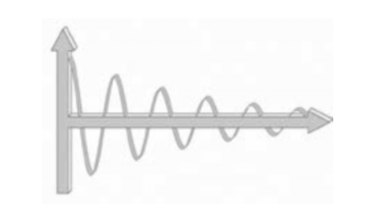

## 36.傻了吧——你以为投资是靠冒险赚钱的吗？

相信你从小到大一直被这样洗脑——反正我是被这样“洗”过的：

> 想赚大钱？那得有冒险精神！

这是最普遍也最有害的“坊间传说”，到了现代，可能得用“都市传说”这个词了。在所有的文化里，每个小孩子在长大的过程中，都以“胆怯”、“懦弱”为耻，也都以“勇敢”、“坚强”为荣，而“冒险”显然是最常见的彰显勇气的方式。

包括我在内，很多人小时候都有过类似的“游戏”经历：看见马路上开过来一辆车，就飞快地跑着穿过马路，然后，一群小朋友在那里听着隐约传来的司机的骂声，洋洋自得、没心没肺地哈哈大笑……许多年后，当我学会了开车才反应过来，那司机可能是吓坏了，而不是气坏了，所以才会使劲儿地骂我们。

关于“冒险”这个概念，观察者和行动者的理解可能非常不同，甚至截然相反——又是两个镜像的世界。

这有点像什么呢？脑外科医生在做开颅手术的时候，他的每一个动作“看起来”都是“危险”的，一点点的失误就可能造成很严重的后果——这是从观察者的角度来看。而从行动者的角度来看：第一，他的目标是成功，而不是冒险；第二，他通过高强度的训练，掌握了完成观察者不可能完成的工作的必须技能；此外，他是专家，他知道什么是危险的、什么是安全的，他知道怎么做事真正的冒险，他更应该知道怎么做才能有效地避险。

于是，在整个过程中，观察者时时刻刻“体会到”各种危险，心惊胆战，觉得行动者在不断冒险，最后是因为冒险才获得了成功。可实际上，**行动者的所有注意力都放在如何避险，而不是如何冒险上**。

请仔细想想，当我们看到有人完成高难度动作的时候（我们是观察者，他们是行动者），他们若“经验丰富”，那所谓“经验”，更可能是“避险经验”，而不是“冒险经验”。如果没有人提醒，我们这些观察者就可能出现理解偏差，误以为行动者拥有的是丰富的“冒险经验”。

我们在价格很低的时候买入大量的比特币，后来大涨也没卖，再后来大跌也没有卖……于是，就有人说：“笑来，你真大胆！”也有人评价：“唉，做大事的人就要敢于承担极大地风险……”

真的吗？真的像他们看到、想到的那样吗？

> “价格很低”是指相对于当前的价格很低。我买的第一批2100个比特币均价6美元（2011年3月），现在比特币的价格是700多美元（2016年12月）。另，比特币曾经涨到1000多美元，又经过两三次“腰斩”（其实那个时候人们同样认为它已经太贵了，赚不到钱了）……可实际上于我来说，在这样的时候购买并不是冒险，因为：
>
> > 如果他竟然是对的，那么他一定不止这个价格。
>
> 我只不过是把最初花费4600元人民币买入的股票，在其已经价值十几万美元的时候卖掉，再买入比特币。所以，即便一切都化为乌有，我也能承受。
>
> 我从比特币价格自十几美元一路下跌的时候开始反复买入，最后均价为1美元左右，直到预算花完，实在没钱再买了。在这个过程中，从我的角度来看，我并没有冒险。当我看到人们恐慌，觉得“比特币已死”的时候（那是2011年下半年），我反复阅读各路报道和文章，没有看到任何站得住脚的理由——真的一条都没有（这很奇怪，也多少令我迷惑）。而到了2014年12月，大涨过后“腰斩”，网络上的文章再次完全重复2011年年底的论调（当然，他们没有剽窃别人几年前写的文章，只是没去了解比特币的历史）。于是，我认为他们是错的（即便他们人多势众，但“人多”和“理正”从来都没有关系）。按照我的思考结果，我就应该持续买入，买不动了就拿住，反正卖出肯定是错的。
>
> 在当时的情况下，按照我的逻辑，不买才是冒险呢！因为我当时的结论是：以长远的眼光来看，这个东西的价格能涨到多少是无法想象的。
>
> 而当时的情形反差很大，那些私下把比特币按照今天来看过低的价格卖给我的人，一方面对我说“谢谢”（因为竟然有人花钱买这东西），另一方面夸我“勇气可嘉”（因为他们当时在暗自庆幸自己终于解脱了）……
>
> 再后来，比特币价格涨到1000多美元（这个上涨过程就发生在短短的6周内，甚至一读超过了每盎司黄金的价格），我没卖。再再后来，两三次腰斩，我也不动。
>
> 这真的是勇气吗？这真的是在冒险吗？其实对我来说不是，理由很清楚：
>
> > 离我的成本价还很远呢，对我来说哪里有风险？
>
> 请务必注意：以上的例子，是我当初对自己投资比特币的思考。它再本文中仅作为“行动者往往更关注避险”的一个例证，绝非投资建议。绝对不要把以上的例子中的文字理解错了，而把它作为你的投资依据。下面这句话无论怎么强调都不过分：
>
> > **你的投资依据必须靠且仅靠你自己的深入思考而得到**。

所以，与很多人想象的全然不同，我其实是风险厌恶型。我小时候可不是这样的，那时我常常以为冒险是勇气的证明。后来，书读多了，历史看明白了，才知道：

> “冒险”常常是他人对冒险者的理解，而不是所谓“冒险”成功的人的行动。

哥伦布之所以被人们称为“冒险家”是因为只有它坚信“地球确实是圆的”（当时能真正理解这件事的人还不多），而且坚信到愿意用行动去证明、用商业去收货的地步。看得人觉得那是冒险，做的人则是在深入思考后不得不做——思考越深入的人，越倾向于坚定地遵循思考结果。

现在大家熟悉的“风险投资机构”（VC）就是一个被民众普遍误解的概念。连很多一线创业者在最初的时候都会或多或少地曲解从事风险投资的机构和个人，他们最常说的话可能是这样的：

> 你不是“风险投资”吗？没风险干嘛让你投资啊？!

这是最典型的“望文生义”。

风险投资模型其实很简单，通俗点讲就是：

> 锁定一个增长最为迅猛的领域，然后在那个领域里投资很多有可能超速增长的初创企业，以期在得到最大化的收益的同时，从概率上保证总体风险降到最低。

VC其实是最懂如何“不冒险”的。风险投资的模型设计，也是为了避险，而不是冒险，目标有两个：

> ▷尽可能获得最大化收益。
>
> ▷尽可能降低系统化风险。

为了获得最大化收益，他们要先锁定他们认为增长最为迅速的领域。例如，在上一个10年里，互联网领域的发展优势“天然”就是其他“传统”领域的成千上万倍。这种“锁定领域”本身也是降低系统化风险的基本手段之一。然后，他们要在这样的领域里去筛选“谁是第一”、“谁的增长速度最快”等，甚至“把前三名都投一遍”，还要和其他VC“报团取暖”、“同舟共济”……这些都是为了降低系统化风险而采取的措施，而不是人们想当然的那样——“竟然是为了冒险”。

换言之，虽然名字里“风险”两个字，但实际上，他们是“避险”高手，而不是“冒险”高手，他们不屑于充当“勇敢者”。虽然当别人那么称呼他们的时候，他们也觉得无所谓，反正“教育他人并不是首要任务”，他们中的一些人甚至乐得顺应大众的理解，不时说一些“风险我们去冒，你们专心把事情做好”之类的话，但实际上，“以更低的风险获得更大的收益”才是他们的核心价值观。这也是“资本”这个东西骨子里应该有的价值观，不是吗？

我们曾经讨论过：为了与他人合作，我们有必要“有意放弃部分安全感”，但这并不是鼓励盲目冒险。在如下两件事情上一定要注意安全，学习并积累避险经验：

> ▷资本安全
>
> ▷人身安全

可人们为什么普遍倾向于在资本上无视风险的存在呢？从总体上看，就是因为人类普遍没有资产管理经验，还没有机会对由资本风险造成的恐惧形成“基因记忆”。若一个小朋友看到桌子上摆着一把枪，他会好奇地拿起来玩，一定都不会害怕，当然也完全不知道那是可能致命的东西；可若在他背后出现一条蛇，哪怕他还没看清那东西究竟是什么，也早已吓得瑟瑟发抖、嚎啕大哭了。为什么会这样？因为我们每个人都有“基因记忆”，很多恐惧早已植入基因，无需讲解，无需教授，天然就懂，天然就会，天然就能感受得到。

现在再来看看——人类对财富和资本的认识，实在是不多、不久、不够，甚至实在是太少、太短、太不够了！如下内容都是毫无疑问的事实：

> ▷人类对财富的认知历史其实没有多久。从人类开始使用货币至今不过几千年而已，这在人类的历史长河中是相当短的一段时间。
>
> ▷长期以来，在人类之中拥有足够财富的人群比例一直是非常低的，那比例其实低到甚至可以忽略不计的程度。
>
> ▷整个人类，除了一个民族（犹太人）之外，迄今为止都会或多或少地将“复利”这个概念“妖魔化”，而“复利”是财富领域最重要的概念（后面根本没必要跟着一个限定词“之一”）。
>
> ▷人类社会的动荡从未停止，古今中外都一样。每一次大的动荡，本质上都是对财富拥有着的杀戮，因此，关于财富的基因事实上很难传承。
>
> ▷人类真正认识到市场的好处（从真正的知识研究角度，而不是“凭直觉”）只不过是最近两三百年的事情（中国在20世纪80年代才重新开启了这方面的认知）。
>
> ▷人类真正研究经济的运作规律，从亚当·斯密开始计算，迄今不到300年。
>
> ▷人类对投资市场的探索，只不过是从200多年前开始的（美国的股票市场是从1792年华尔街的一颗西印度常绿树下的露天交易开始的）。
>
> ▷人类对概率的真正认知，是从十六、十七世纪开始的。而将对概率的研究脱离赌博，应用到资本和风险评估上，要到20世纪初才算起步，迄今不到100年。

也就是说，在财富与资本领域，对于风险的认知，对整个人类来讲，根本不可能产生“基因记忆”，也根本不可能天然就懂、天然就会、天然就知道该怎么做。当然，最可怕的不是不懂，而是明明完全不懂却不知道自己不懂，甚至觉得自己很懂……

人类与大自然大面积共处的时间是数十万年，可谓经验丰富；然而，人类与资本打交道，却相当于全然没有经验。关于冒险的“基因记忆”，是人类与大自然斗争的过程中养成的。现在，若把这些经验运用到“与资本打交道”、“与资本共处”上，则基本上是不适用的。

这是不变的生存法则，开车如是，生活如是，投资、创业亦如是。只要涉及人身与资本：

> ▷安全第一

然后才是下一条原则：

> ▷成为专家

锤炼自己的学习能力，需要什么就学习什么，成为那个领域的专家，然后像专家一样思考、决策、行动。专家不轻易冒险——虽然电影和小说里经常渲染他们如何在关键时刻“冒险”，但那是大众娱乐，若不那么描写，大众就不相信。

别人也许会赞赏你的勇气，而你却要知道，“勇敢”从来都不应该是需要自我证明的东西。这真是跟整个社会唱反调——它教育我们要“勇敢”，却从来不告诉我们，那是它需要的，而不是我们需要的。

要知道，只有爱面子的笨蛋才需要证明自己有勇气。他们不懂的是，虽然一时的面子保全了，他们却早已成为被时间碾压的对象。所以，一定要认真仔细地：

> 看傻瓜们冒险。

看的多了，你的避险经验就丰富了。

结论是这样的：

> 在做事之前一定要想清楚，要深入思考到你的结论已经和绝大多数人不一样——要做到“特立独行且正确”才行。在这样的时候，你做出来的事情会把别人吓到。他们觉得你在冒险，你却知道实际上是怎么回事。

有一本比读书：*Fooled by Randomness。* 这本书的作者是纳西姆·尼古拉斯·塔勒布（Nassim Nicholas Taleb），他也许是地球上最聪明的人之一。他还有两本书：*Black Swan*和*Antifragile:Things That Gain from Disorder。*前两本书是他为了让读者读懂最后一本书而写的“序”。

再深入一点——避险也是有方法论的。做什么都不能做“险盲”（这是我借用“文盲”这个词汇的结构杜撰出来的词汇，指那些不了解风险，不知道如何回避风险，更不懂如何控制风险的人）。文盲的一生其实很吃亏，险盲的一生更是如此。文盲可以通过（自我）教育得到解放，险盲也一样。

假设有两个人玩公平的抛硬币赌输赢游戏，规则是：

> ▷赌注大小恒定。
>
> ▷直至以防输光，游戏才能结束。

请问，最终决定输赢的是什么（单选）？

> A.手气
>
> B.谁先抛硬币
>
> C.抛硬币的次数
>
> D.游戏总时长
>
> E.以上皆是
>
> F.以上皆不是

实际上，风险教育应该是理财教育，甚至应该是整个教育中最重要的部分。也不知道是什么原因，他竟然一直被忽略，人们能见到的风险教育顶多是在学校或一些机构里进行的防火模拟演习。火灾其实只是风险的一种，有一个术语是“不可抗力造成的系统风险”，而这也是我们必须不断自我教育的原因。**仅靠别人教永远不够，要靠自己学才行。至于“活到老，学到老”，其实只不过是一种生活方式。**

如果你在做上面的选择题是多少犹豫了一下，或者选择的答案竟然不是“F”,那你还真的或多或少就是一个险盲。不过，一篇文章的光景，你就基本上可以“扫盲”了——这本身不是一件困难的事情。

首先，要平静地接受第一个事实：

**第一，风险是一种客观存在。**

风险在那里，不离不弃，不会因为你怕或者不怕它就有所变动。甚至，从广义上来看，即便你什么都不做，还是时时刻刻有风险的陪伴。

为什么风险几乎永远存在呢？因为第二个事实：

**第二，一旦有未知存在，就有风险存在。**

为了了解风险、研究风险、回避风险、甚至控制风险，人们鼓捣出一个数学分支——概率统计。这几乎是所有人都应该认真学习的学科，只可惜，好像绝大多数人都只是应付一下考试就把如此重要的知识“还给老师”了。

在学过一点概率的人中，有一个普遍的误解，就是认为“风险的概率决定风险的大小”。可实际上，衡量风险的首要因素不是风险的概率。这就是我们要提到的第三个事实，也几乎是摆脱险盲的最重要的事实：

**第三，衡量风险大小的决定性因素是赌注的大小。**

关于之前的那道选择题，最终决定输赢的是谁的赌本更多。

由于赌注是大小恒定的，又由于抛硬币是概率为1/2的游戏，所以，如果双方赌本一样多，那么最终双方输赢的概率都是1/2.可是，如果一方的赌本更多，那么他最终获胜的概率就会更大。由于玩的是概率为1/2的游戏，多以，如果一方的赌本是另外一方的2倍以上，那么前者几乎必赢。也就是说，在这个游戏里，赌本相对越多，输的概率越趋近于零。

如果你参与这个游戏，一上来发现那个“恒定大小的赌注”比你的总赌本还多，那你就不应该参加。如果你的赌本只够下1注，虽然赢的概率依然是1/2，但从长期来看，你没有任何胜算。

很多人看起来一辈子倒霉，可实际上，那所谓“倒霉”是有来历的——他们对风险的认识是错误的。他们倒霉的原因只有一个：

> **动不动就把自己的全部赌进去。**

赌注太大，则意味着结果无法承受，为什么赌本少的人更倾向于下大赌注呢？据说是因为自身越差的人梦想越大。在高速公路上把车开得很快还不愿意系安全的人——险盲，因为这些人不知不觉就把自己的性命当成了赌注。经常做铤而走险之事的人——险盲。在股市里因为怕自己赚得少儿拿出全部身家（甚至借钱，更甚至借钱做杠杆）的人——险盲。

上面的讨论其实涉及第四个重要的事实：

**第四，抗风险能力的高低本质上就是总赌本的大小，尤其是在面临同样概率的风险的时候。**

反过来看，当赌注恒定，赌本却相对无限大的时候，即便遇到99.99%的风险概率，玩家其实也全然无所谓——赌注相对太小，输了就输了吧。

还有一个现象需要注意：**在赌注相对大的时候，智力会急剧下降。**为什么高考的时候总有一些人考砸？就是因为赌注（自己的未来）太大，以致压力太大，进而无法正常发挥。

同样的事情也发生在国际台球大赛上。那些天天刻苦训练的选手，每一个在训练的时候都能经常打出“满贯”，但在整个赛季里也没有几个选手能在赛场上做到。为什么呢？就是因为赌注太大了。平时训练的时候没有赌注，也就没有压力。这也可以反过来解释一个常见的现象：历史上所有成功的庞氏骗局都有一个普遍的重要特征，那就是“加入费用惊人地高”，因为只有这样，进来的人才能普遍不冷静。

所以，人真的不能穷，不能没有积蓄，否则真的会在某一瞬间突然变傻。另外，永远不要“all in”，这在很多时候不是空话，真的要放在心上。

**第五，冒险没问题，但尽量不要被抽水**。

“抽水”是赌场里的术语，是指赢家要支付盈利中的一定比例给庄家。不要以为赌场太阴险，实际上，开赌场、保证公平就是需要开销的，所以，玩家支付抽水是合理的。也不用以为股票交易所太贪婪，实际上，他们收手续费也是合理的。这些就是无所不在、不可消灭的“成本”。

**公平是有成本的**。有抽水机制的赌局在本质上是倾斜的。因为即便是抛硬币的游戏，在加上抽水机制之后，从长期来看，所有的玩家都会输光，所有的赌注最终都会转化成抽水这的利润——就好像一个正弦函数被改造成阻尼正弦函数一样。

阻尼正弦函数

[**返回目录**](./menu.md)
