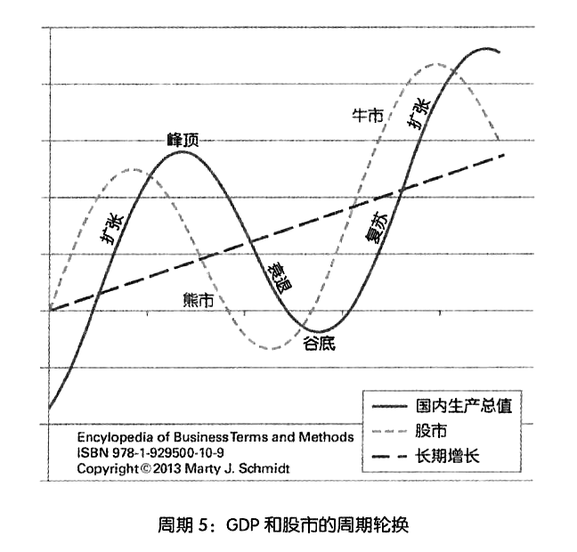

## 40.10分钟教会你判断趋势，你信不信？

许多年后，身边的朋友可是这样评价我：

> “笑来，现在看来，你在判断趋势上真的很厉害呢……”

相信我，我真的不是在用上面的话显摆自己，了解我的人也知道，我确实没有显摆的需求。在消除了可能的误会之后，我要请你把注意力放到上面评价中的一个措辞上——“现在看来”。

这个措辞的意思输出说，在此之前的很长一段时间里，他们并不认为我是对的——是呀，谁对未来有那么确定的判断呢？我又不是传说中算命的！反过来，证明“自己对未来的判断是正确的”之所以难上加难，是因为：第一，要到很久之后才能有确定的结果；第二，即便判断是对的，现实也不一定会当场给你正反馈；第三，就算结果站在你这一边，你也不能保证没有运气因素的存在，而完全都是你的判断在起作用；第四，最终每个人都会明白，没有谁的正确判断本身就能改变世界，除非有不顾一切的行动。嗯，“人至践则无敌”。

首先，让我们深入研究一个看似简单，貌似每个人都早就明白的概念：周期。

**周期**是理财投资活动中最为关键的考量因素，是在实践之前必须学习、研究、掌握、遵循的理念和现实——可惜，它总是被忽略。它也是市场上大多数理财书籍中干脆不提，或者放在最后一笔带过，实际上却最为基础、最为关键的知识点。

**如果不深入了解周期，就无法对趋势进行有效的判断**，整个投资活动基本上就是没有判断的行为，甚至不如两个人抛硬币赌博——而在这样的时候，墨菲定律一定会显灵：

> 如果一件事情可能变坏，那么它一定会变坏。

以后你会明白，这世界上所有的事情其实都是投资：成长是用自己的注意力向自己投资；婚姻是双方共同投入自己的各种资源去创造一个更好的家族；工作是投资；创业是投资……一切都是投资（从另外一个角度看，我也认为这世界上的一切活动都是销售）。

**周期**这个概念，在很多投资者嘴里，通常由“**趋势**”这个词代替。他们会说：

> ▷“现在是上升趋势。”
>
> ▷“现在是下降趋势。”

这种描述尽管有时候还算管用，但更多的时候是肤浅的、危险的——因为一个上升趋势要加上一个下降趋势才构成一个完整的周期。而实际上，**真正的趋势常常需要在多个周期（至少两个）之后才能真实展现**。

> **现实的经济里没有直线，只有波（动）。**

在一个很长的波段中，在任何一个点上向前或后望，看起来都像自己处在一条直线而不是曲线上——就好像我们站在地球上却很难感知自己其实是站在球面上而不是平面上一样。

一个上升与一个下降构成一个周期。2个或多个周期之后，如果我们发现曲线就好像数学课本里的正弦曲线，那么所谓“趋势”实际上就是一条水平线而已。而我们常常说的且在寻找的所谓“**趋势**”，应该是一条要么上升、要么下降的线条才对，因为“水平”等于“无变化”，**无变化就是无趋势**。

这就解释了为什么有些人认定的所谓“趋势”在另外一些人眼里根本谈不上是趋势，因为后者重视的是1个以上的周期之后所显现的真正的趋势，而前者看到的只不过是在一小段时间里的表象而已。

这也解释了为什么“追涨杀跌”的人必然很吃亏，因为他们看到的并不是实际的趋势，他们看到的和把握的只不过是幻象而已。

在交易市场里，有一种人被称作“韭菜”。为什么呢？因为韭菜总是割掉一茬再长一茬，交易市场里的“韭菜”就是指注定会被“收割”的人。如何判断自己是不是“韭菜”呢？其实很简单，当你身处交易市场时，脑子里存在以下闪念中的任何一个，你就是“韭菜”——确定无疑的“韭菜”。

> ▷X靠谱吗？你怎么看？你说Y能涨吗？
>
> ▷X已经太贵了，买不起，我去看看Y吧。
>
> ▷真倒霉，一买就跌，一卖就涨！
>
> ▷刚才没看到你们说什么，我错过了什么吗？
>
> ▷都一整天了，在吗不见涨呢！
>
> ▷赚了赚了，我这就去换辆车！
>
> ▷跌惨了，媳妇要跟我离婚！
>
> ▷唉，等我借来钱，已经涨上天了！
>
> ▷他们运气真好！我运气真差！
>
> ▷骗子！你们都是骗子！

顺带说一句，**许多年前，这些闪念我都有过！**

如何把自己变成“另外一个物种”，而不再是“韭菜”呢？方法之一是：在判断趋势的时候，看至少2个周期——多简单啊！可惜，当初没人给我讲透，所以我被“收割”了很多次。想明白之后，虽然“交了很多学费”，但我再也不是“韭菜”了。

若我们真的能够看到多个周期，趋势就会明显到我们无法忽视的地步。

下图是1800年至2012年股票和债券的收益比较图，上面那条线是股票指数（SPXTRD）,下面那条线是债券指数（TRUSG 10M）。

起起落落这么多年，股权投资和债权投资的趋势其实是一样的，都在上升，只不过虽然债权投资“看起来更稳定”（即，波动相对比较小），但涨幅落后于股权投资。

而通过下面这张图你就会发现，从长期来看，投资黄金、美元什么的，与投资股票相比，简直“弱爆了”——不管你是否同意。这也是现在越来越多的人认为“**股权收益时代来了**”的重要原因——其实早就存在了。

才过了几分钟，你竟然已经可以从一个趋势中看到其他更深层次的趋势了。人是可以进步的——不仅如此，进步有可能是非常快的，而且，有一些进步可以在瞬间完成。而那些没机会想到的人，弄不好一辈子都被无知和不进步耽误且完全不自知。

所以，**关注周期，以及多个周期背后显现出来的真正趋势，会给你一个全新且更为可靠的世界和视界**。

进而，几乎一切事物，无论是抽象的，还是具体的，都有自己的周期，只不过它们的周期不大可能一致。于是，几乎一切机会和陷阱都隐藏在周期与周期的差异中。

据说GDP和股票的周期轮换是这样的：

还有一个“库伯勒·罗斯改变”（ Kübler-Ross change curve）,特别好玩儿，它看起来是这样的：

更进一步，人们发现任何新生事物的发展过程也是差不多的（transition curve）:

于是，我们可以反思这样的现象了：

> **每当巨大的技术变革出现时，都有一批投资者“死”在路上。**

为什么？因为他们看到了所谓“趋势”，却忘记了或者不知道真正的趋势需要经过1个以上的周期才会真正显现。回顾一下，互联网、NETPC(后来的所谓“云”)等都是如此。

刚刚闯入交易市场的人，往往不知道一个冷冰冰的事实：

> 在牛市里赔钱的人其实很多，在熊市里赚钱的人其实也很多。

读到这里，你可能会楞一下：“在牛市里怎么可能赔钱！”“在牛市里怎么可能赔钱！”“在牛市里傻子都能赚钱！”仔细观察一下，你就会知道，事实并非如此。当然，不排除有在牛市里赚到钱的“傻子”，但也确实有很多人在牛市里担惊受怕、最涨杀跌——因为一个回调就“割肉”，又因为不甘心而加上杠杆，到最后落得无法诉说的下场。

他们为什么会这样？理由很简单：他们的眼光穿不透周期，看不到真正的趋势，有的只是最肤浅的理解，于是，他们的一切行动都像是乱打乱撞的“无头苍蝇”，事实上比“拿着火把穿过火药厂”还可怕——他们“拿着火把四处乱窜”。

**对周期的深入理解，甚至可能影响一个人的性格。**在我看来，所谓不屈不挠，所谓坚持不懈，在更多的时候，只不过是因为对自己在所处的周期中的位置非常了解，才更容易作出的决定。

为什么你的很多机会最终无法落实，不了了之？背后最深刻的原因很可能是：你当时所处的生命周期与世界的种种周期（例如经济周期）都不相同，于是，没有人能帮你具体制定完全适合你的计划。所以，人生规划这种东西，听不得别人的，必须自己来，否则也没法“后果自负”。

人各有别。就好像在一个动物园里，有老虎、狮子、有鹦鹉、孔雀，有鳄鱼、蛇，还有还多不知藏在哪里的昆虫，他们都有自己的生存之道，都有自己的优势和劣势，没有太多实际上有意义的、通用的、普适的优势策略。

如果非要挑出一个，就是：

> **繁殖能力强是王道。**

用投资领域的话来说，就是：

> **赚的方式越多越好**。

太简单了吧？是的，简单到好像没必要教育或学习似的。其实，这也是在传递重要知识时所面临的的困惑与困难：

> 越是重要的东西，越是看起来并不相关。

很多人问我：“笑来，你现在的主业是什么？”我笑嘻嘻的回答：“‘得到’专栏作家啊！”可是，在这个专栏里，我会告诉你为什么我总是能用各种各样的方法赚钱：

> 因为我必须有投资以外的各种赚钱方法，才能确保自己能给自己的投资金额“判无期徒刑”（至少是“判”更长的“有期徒刑”）。

如果我只凭投资赚钱，也不是不好，但我觉得还可能做不好——因为我的心态会变，会患得患失，会不由自主地把眼光和注意力从远方挪到眼前，变成“近视眼”，看不透周期，看不到趋势，能看到的只剩下涨跌，于是，必然会退化为“韭菜”——那又何苦？

[**返回目录**](./menu.md)
