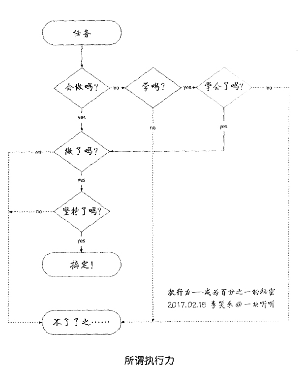
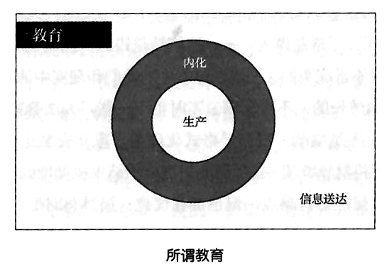

## 48.执行力差的根源在哪里？

不管你的执行力是不是强，你都知道总有一些人的执行力很强，是不是？即便你的执行力不强，你也知道执行力很重要，是不是？当我们面对一项任务的时候，所谓“执行力”其实有另外一个定义：

> 所谓“执行力”就是指一个人是否清楚地知道要怎么一步一步做下去。

如果你会做，直接去做就是了。如果你不会做，当然要去学了！学会了就开始做。而如果你学不会那原本就应该接着学，可绝大多数人在这李却选择了“不了了之”。还有更狠、更气人的情况：

> 明知道事情应该怎么做，甚至很清楚每一步应该怎么做，可就是不做，没做。也不是不想做，但反正不是今天做——明天再说呗……

最气人的情况是这样的：

> 也不是没做——做过，很早就做过，但就是没有持续做……反正也不知道是为什么。

在如下这幅图里，虚线部分实际上是绝大多数人终生不断循环的路径。虽然每个人都知道自己应该走那条实线的路径，可真的不知道为什么，最终就是没能走在那条路径上——我都听见你们心里的叹息了！

事实上，我们每个人都有执行力，而且都有很强的执行力。只不过，比较奇怪也比较让我生气的是：

> 我们都格外擅长把没必要的事情做到底。

例如，我是“烟鬼”，我也知道抽烟事实上完全没必要，但我就是很自然地坚持抽烟，而且，我甚至可以很冷静地得出符合逻辑的结论，告诉自己，也告诉别人：我“没必要”戒烟。你说我傻也好，说我楞也罢，我根本不在乎。

千万不要笑话我，因为没人有资格为这件事笑话我，因为每个人都有这种能力，而且每个人都有很强的这种能力——你也一样。例如，你是女生，你在当前这种文化里长大，受这种文化的熏陶，于是，你在很大的概率上每天都要问你的男朋友或者老公“你爱我吗”、“你是不是最爱我”，诸如此类。有必要吗？事实上没有必要。但感觉上呢？反正，你就是会天天问，恨不得每天问几万遍。再如，现在90%以上的人每天手机不离手，可能在一分钟内就要打卡手机好几遍，其实打开手机也不会做什么，但就是觉得若手里没有手机，心里就空荡荡的。有必要吗？事实上没必要。但，那又怎样？自从手机有了大屏幕，变成了所谓“智能手机”之后，人们丢手机的概率都大幅降低了，因为手机已经彻底变成了每个人身体的一部分。

你看，每个人都很擅长把很多没必要的事情做到底。所以，我们每个人都有很强的执行力，只不过，总是在必要的事情上，我们的执行力就好像失灵了一样……

这也许是个公开的秘密：

> 我们的身体里不止有一个自我。

为什么说这是“公开的秘密”呢？因为关于我们的身体里“好像”有不止一个“自我”这件事，人们很早就意识到了，只不过长期以来没有足够合理、精准的解释。

在2000多年前，苏格拉底和斐德罗就讨论过这件事，柏拉图还做了记录。苏格拉底很聪明，他相信聪明人是不要自己做记录的，只有用脑子记住就可以了——幸亏柏拉图觉得自己笨，于是把苏格拉底的对话都记了下来……

当时他们认为，人的灵魂有三重本质，还为此画了一幅画：一个骑手，驾着一辆由一黑一白两批带着翅膀的马拉着的战车。黑色的马代表欲望灵魂；白色的马代表意志灵魂；骑手代表理性灵魂，要驾驭这两匹神驹勇往直前。

在心理学发展的早期，弗洛伊德把这个类比改头换面，其实就是“偷懒”换了个不一样的类比：完整的人格由三大部分组成，分别是本我、自我和超我……不细说了，没必要。

最近二三十年，一个叫做“脑科学”的领域发展迅猛。现代科技让我们有了足够的技术手段去研究大脑的构造和运行机理，以至于我们今天对自己的那种好像是天然的精神分裂症状有了清楚和彻底的解释。

人类的大脑分为3层。最里面的那一层在爬行动物时代就发展好了，我们不妨把它称为“鳄鱼大脑”，它用来指导我们的身体完成各种应激反应——就像鳄鱼那样。鳄鱼只有这一层大脑，它们没有情绪，没有理智，只有5种应激反应（都可以以“f”开头的词汇描述），就在地球身生存了这么多年。

> ▷如果入侵者是同类，同性，且不如自己强壮，那么“fight”!
>
> ▷如果入侵者是同类，同性，且比自己强壮，那么“flee”!
>
> ▷如果入侵者是同类，异性，那么“fuck”！
>
> ▷如果入侵者不是同类，不管它是同性还是异性，只要不如自己强壮，那么“feed”!
>
> ▷如果以上皆不是，那么“freeze”。

人类的第二层大脑在哺乳动物时代就发展出来了，我们不妨把它称为“猴子大脑”。简单地讲，这层大脑用来生成各种情绪，包括最基本的恐惧、兴奋等。这样的情绪实际上是对各种外界刺激的高级综合反应：感受到危险要产生恐惧，以便迅速逃离；见到猎物要足够兴奋，以便身体的各部分协调起来，足够有效率……顺带说一句，家里养的宠物虽然没有理性，但有情绪，他们也会开心，也会难过，也会兴奋，也会害怕……

人类最终发展出了几乎独一无二的第三层大脑，学称“前脑额叶”。不夸张地讲，人类文明都是建立在前脑额叶之上或者之中的。

我们每个人都多次经历过“突然之间大脑一片空白”的情况，你知道那个时候你的体内发生了什么事情吗？大抵是这样的：

> ▷我们的脑细胞活跃是需要大量能量的，例如氧、糖等。
>
> ▷我们的心脏位置决定了大脑所需的能量会先输送到“鳄鱼大脑”（即，最内层的大脑），然后输送到“猴子大脑”，最后才能抵达“人类大脑”（即，前脑额叶区域）。
>
> ▷当我们突然受到惊吓，或者突然情绪激动的时候，内两层的脑细胞最先活跃起来，消耗了大量的能量，因此，外层负责处理理性的大脑区域完全没有能量供给，只能“暂时休眠”。

所以，从现代科学的角度解释，所谓“更为理性的人”其实是前脑额叶区域相对发达的人。

这样看来，像苏格拉底、斐德罗、柏拉图那样的人，直觉惊人地准确。那批黑马对应着“鳄鱼大脑”（直觉），那匹白马多少有点不准确地对应着“猴子大脑”（情绪），而那个骑手（理智）则好像清楚地对应着“人类大脑”（理智/元认知）。

你可以这样理解——在最初的时候，我们的“战车”是这样的：

> ▷黑马很强大（直觉）。
>
> ▷白马次之（情绪）。
>
> ▷骑手只不过是个孩子（理智/元认知）。

请注意：在这本书的语境里，“元认知”与“理智”常常可以互换。

所以，我们的“战车”其实挺烂的，跑起来歪歪扭扭，弄不好就会兜圈子，马不听话，骑手年幼……可以一旦如此理解，我们马上就能反应过来，我们真正的任务是：

> 用一切办法改进战车的性能！
>
> ▷想办法让骑手尽快成长。
>
> ▷想办法让白马和黑马一样强大。
>
> ▷想办法让骑手和马配合好。

**首先要纠正一个普遍的错误认知。在过去相当长的时间里（甚至包括现在），人们常常错误地把理智与情绪、直觉对立起来**，搞的好像：

> ▷理智最高级，我们只需要理智就够了。
>
> ▷情绪一点用都没有，有也只能是害处。
>
> ▷直觉都是错的（尽管我们不得不承认——少数人的直觉非常厉害）。

这其实非常荒谬，就好像骑手、白马、黑马原本是一家人，现在非要离间他们一样——还要“科学”地、“有理有据”地让着一家人分崩离析。于是，连带出现了一系列貌似合理，却不仅不起作用，还会起反作用的理论与建议。例如，“最大的敌人是自己”、“一定要战胜自己”这样的说法不仅是错误的，还是有害的，更是违背事实的。骑手、白马、黑马根本不应该以“干掉对方”为目标。那应该以什么为目标呢？合理的目标是：和睦相处。

我们必须接受一个事实：最终，黑马、白马、骑手谁都干不掉谁。想象一下：如果黑马和白马被“干掉”了，骑手驾驭谁去，战车还能跑吗？

**还有，不应该用先入为主的道德判断来衡量他们。**人们常常为黑马的想法和行为感到羞耻，但这其实是不对的，是违背事实的，当然也是有害的。历史上有很多记载，例如，某个传教士因为自己的性欲太强烈，总是不合时宜的场景勃起而羞愤难当，最后只能采取极端的方法，用石头砸烂了自己的性器……对黑马，我们应该采取成年人对待小孩的态度——耐心调教，而不是“哎呀，这孩子太烦人了，我不管了”。

有的时候，在我们的脑子里会产生一些奇怪的、甚至非常邪恶的“闪念”，那并不是因为我们已然变成了坏人，而是有科学解释的：只不过使我们大脑中的一些原本没有关联的脑细胞（活用“神经元”这个词也可以）突然相互关联了一下。你可以把这些“闪念”想象成“大脑和自己玩儿，天马行空，弄出来的一些’意外‘的念头”——它就是在好奇地左一下、右一下地“试”着玩呢。而当那个“闪念”出现之后，你吓到了，想：“我怎么这么邪恶啊！”在这个时候，这不仅不是坏事，反倒是好事，这说明你的元认知能力在正常工作，它在审视自己的每一个操作步骤和操作结果，然后作出判断——“这个念头不好”（即，“这个关联是没用的、不必要的”）。反应过来了吗？邪念和灵感的产生过程其实是一样的，你要做的不是“消除邪念，克服诱惑”，而是让元认知正常工作，让它知道什么是好的，什么是不好的，什么是更好的，什么是最好的。

**再进一步，你要明白，黑马有黑马的用处，白马有白马的用处，**他们不仅谁都不能消灭谁，而且恰恰相反，它们是相互需要的，谁离了谁都不行。也就是说，直觉有直觉的用处，情绪有情绪的用处，元认知有元认知的用处，他们各司其职，相互配合，才真的厉害。

真正有意义的深刻理解是：

> ▷情绪是理智的快捷方式。
>
> ▷直觉是情绪的快捷方式。

直觉（黑马）的反应比情绪（白马）快，情绪的反应比理智（骑手）快。这是由生理结构造成的，因为黑马离心脏最近，所以最先获得血液和各种养分，然后是白马，最后才是骑手。这也是“在刚开始的时候，连唤醒骑手（理智/元认知）都很难，让他成长就更难”的原因。

不过，随着骑手的成长，他会直接给自己已经习得的本领建立“快捷方式”并将其固化到白马身上。显然，这样处理起来速度更快，相信你已经有过深刻的体验。

> ▷过去，你以为金钱最重要，而不知道注意力的宝贵，于是，你整天浪费自己的注意力而不自知，在“人生三大坑”里幸福地活着。那时的你，凑热闹、随大流、为别人操碎了心，而且，你并不知道自己身在“坑”里，于是你常常情绪不错，只是在元认知偶尔审视自己的现状时有点难过而已。
>
> ▷后来，你的元认知升级了，你建立了新的价值观，知道了“注意力>时间> 金钱”，你从“人生三大坑”里爬出来了。你会发现，你关掉了朋友圈，不再关心所谓“热点”，不再随便好为人师，把自己的注意力放到了更合适的地方（例如，自己的成长）。你的情绪开始反过来到了（在另外一个镜像世界里）——有人和你讨论所谓“热点”，你开始觉得无聊；有人随大流，你却一点都不浮躁；有人为别人操碎了心，你却觉得那很可笑……

所以，事实上完全没必要“控制”情绪，也没有必要“消灭”情绪。最有效的调教白马的手段很简单：让骑手不断学习新的概念，打磨、更新旧的概念，锤炼更好的价值观，反复思考，重复应用，然后把它（教）给白马（即，建立正确的情绪）。最神奇的是，对那新知识、新技能，若白马用的多了，还能把它们传递给黑马，而黑马的反应速度更快……

那些被评价为“看人很准”的人，通常会表示：“不知道为什么，我第一次见到那人就知道他是那样的……”事实上，这不是他们天生的直觉，而是后天习得的——先是骑手学会并多次重复应用，然后传递给白马，继续重复应用，到最后连黑马都学会了。而这个过程发生在很久以前，于是，他们真实的感受总是：“不知道为什么，直觉告诉我……”

所以，虽然叫“直觉”，但不同人的直觉，质量却相差很多。这是物种之间的差异，因为绝大多数有效的直觉是要让元认知（骑手）先学会才能逐步建立的。“跟着感觉走”也不是很多知识分子肤浅地认为的“肯定是错的”——万一那情绪是专家通过训练自己的元认知进而建立的快捷方式呢？

建立更重要、更有效的快捷方式（情绪与直觉）本质上就是把学到的东西内化的过程，所以，情绪与直觉也都是习得的。2017年，当“美联航事件”发生后，群众都很愤怒——这也没错。而沃伦·巴菲特呢？他不仅不愤怒，还挺高兴，因为直觉告诉他：机会来了。一个垄断企业的股票价格悬崖式下跌——还有比这更好的机会吗？于是，他理智地大幅度加仓。当然，他不是没有社会责任感的人，他冷静地批评美联航，希望他们改进。而如此这般，美联航的股价也可以回到正常水平。学吧，学吧！看看人家的白马和黑马，看看人家的骑手！

**还有，要知道黑马、白马和骑手最终都不是完美的。**人们总是幻想自己能够“改头换面”，“重新做人”——这依然是错的，也根本做不到的。从一开始，他们就不是完美的。在成长过程中，他们和现实中的所有东西一样，都是连滚带爬地成长的，不时犯错，不时犯下一些“无法弥补”的错……他们和我们一样，不是电脑，没有“格式化硬盘，重新安装干净的操作系统”的功能，都只能将就着继续，忍受着历史造成的结果执拗地向前。而且，他们是“一家人”，虽然都有缺点，但也都有优点；虽然有时配合不佳，但还是要相互容忍，相互促进，出错了一起承担后果，做好了再接再厉。

最后，要深刻理解“快捷方式”的建立过程，即，新习得的知识的内化，需要很长的时间，需要很多次的重复，需要很多次的应用，直至能够不假思索地完成。

很多人对“教育”只有肤浅的理解，当然也不可能对“自我教育”有正确的理解。人们总是以为“告知”就是教育，以为“知道”就是完成了“自我教育”，却不知那知识表面上的步骤。他们完全忽略了另外两个重要的环节：“内化”和“生产”。

前面反复提到的两个词：“重复”与“应用”。

“重复”就是“内化”的过程。例如，开车的人从刚开始的笨拙到后来的熟练，最终达到方向盘就好像长在手上，刹车、油门就好像长在脚上的程度，就是内化的过程。而卖油翁说的“无它，唯手熟尔”，就是内化完成的结果。

“生产”就是反复“应用”那些通过重复完成了内化的新技能，通过产出反过来进一步强化那些新技能。最明显的例子是写作。写作是反复思考并反复输出思考结果的过程，在这个过程中，更强的逻辑能力被内化，更强的表达能力被内化，更强的沟通能力被内化，更强的感染力和影响力被内化，而且发生这一切的原因和结果都是元认知能力的不断强化与内化。在《通往财富自由之路》专栏的每一篇文章下面都有很多留言^[1]^,只要稍加留意，你就会发现，很多人的留言质量急速上升，在最初的时候不过是只言片语，很快就变的篇幅更长，逻辑更严谨，例证更有力，表达更丰富……不夸张地讲，这个专栏用一年的时间培养了几万个潜在的作者——我也很开心呢！

于是，没有产出的教育是没有任何意义的（这就是过往的教育总是失败的根本原因）。“自我教育”失败的原因也是一样的：你不生产，就是实际上什么都没有——能识字，能看书，却什么也做不出来，还有比这更失败的吗？

我一向认为，能“想明白”的人都有很强的执行力，执行力不是吃独立存在的，它只是“想明白”这个动作的自然结果。而一切的“半途而废”，其最合理的科学解释，也是最朴素的解释是：重复与应用的次数不够，内化过程没有完成，大脑皮层沟回构建失败，应该建立的神经元关联不够强以致断掉，回到了原本没有关联的状态。

执行力差的另外一个解释，也是更重要的解释，是我们早就讲过的：执行力强的人和执行力差的人是两个完全不同的物种，他们个字生活在与对方截然相反的镜像世界里。虽然你觉得跑步累，但不见得所有人都觉得累，总有“另外一个物种”愿意到健身房里跑步，大汗淋漓，让自己精神焕发；虽然你觉得某件事很无聊，但不见得所有人都觉得无聊，总有“另外一个物种”兴致盎然地做着你完全不能从中体会到快乐的事情；虽然你觉得做某件事很辛苦，但不见得所有人都觉得辛苦，总有“另外一个物种”就算不吃不喝也要把它做完——谁拦着，他就跟谁急！

如何提高执行力？进化成“另外一个物种”就可以了。到时你就会知道，那根本就不是逐步提高的过程，而是从零起步，在开始的一瞬间就达到“满血”的状态。

---

[1]你可以在http://caifu.xinshengdaxue.com上查看所有留言，我没有对这些留言进行任何删减或编辑。

[**返回目录**](./menu.md)
