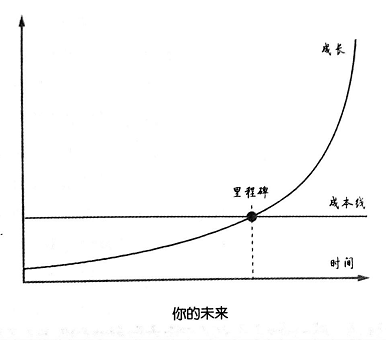

## 50.为什么“共同成长”才是最好的出路？

对很多人来说，教科书里的概念是学来应付考试的，考试过后，那些概念就被他们扔掉了，美其名曰“还给老师了”。这样的习惯使大多数人从不审视自己正在使用的概念。其实，生活中的每个概念都需要审视、清理 、升级、重新审视、重新清理、再次升级……

再一次，让我们从一个特别简单、特别基础，也是我们一生都在使用的概念开始：

> 朋友

什么是朋友？我就从自己说起吧。以下提到的“我们”其实都是指我自己，如果你有共鸣，那你就属于“我们”。

在最初的时候，我们虽然朦胧，但实际上是有所定义的：

> **朋友就是那些与我们共读时光，让我们感觉到温暖的人。**

这里有个词：“感觉”。对，友情就是一种感觉，它让我们温暖。我想很多人都和我一样吧？

然后，我们慢慢长大。在这个过程中，我们的操作系统有一些基于历史和文化习惯的细微的渐进升级。满满地，我们对朋友多了一个标准：

> **朋友就是那些与我们共度时光，让我们感觉到温暖，让我心甘情愿地付出的人。**

在这里我使用了一个很中性的描述：“让我们心甘情愿地付出”。你也知道，在很多时候这其实是不可能的。

在我们东北老家，这叫“够意思”。小孩子在交往中慢慢学会另外一个概念，叫“义气”，然后不由自主地把这个概念和“朋友”这个概念揉在一起。在那个时候，我们还不擅长思考，不会意识到“够义气”、“够意思”这样的概念其实是一种“毒药”，虽然它看起来是那么美好。

尽管我现在说那时“毒药”，但在当时却真的不知道。为什么说那是“毒药”呢？因为我们不由自主地在一个纯净的概念里加入了“公平交换”的机制。问题又来了：对于“什么是公平”，我们根本没想过。人就是这样，即便不知道什么是公平，但当不公平发生的时候，却可以瞬间体会。

于是，开始有了背叛，开始有了欺骗，开始有了失望和愤世嫉俗。于是，我们进入了一个相对混乱的时期。

过了一段时间，我发现人和人特别不一样。大多数人的生活空间是相当有限的，很多人出生、成长、结婚、生子直至死亡，都在一个地方。即便是在大城市，也有这样的人——北大幼儿园、北大附小、北大附中、北大本科、北大研究生、北大博士、北大工作……我真见过这样的人，还不止一个。

我呢？我出生在黑龙江梅林县，在8岁的场子跟随父母搬到吉林省延吉市，小学转学一次，初中转学一次，高中复读一次，然后离开老家去长春读书，毕业后没有回老家，而是去了沈阳，后来回老家待了一段时间，又辗转广州，而后定居北京。对我来说，被动且长期好像是不存在的。回望从前的岁月，对人从小交下的朋友不多，但几乎每一个都是因为我主动与之保持练习才一直有联系的。维系交往是要耗费时间和精力的，在两个人的交往过程中，一定至少有一个人是主动的，而我就是那个主动的人，因为我觉得这些“成本”是必然的存在的，也是我必须承担的。

所以，朋友的定义在我这里开始发生变化。在我这里，所谓“朋友”是这样的：

> 朋友就是那些与我们共读时光，让我们感觉到温暖，让我们心甘情愿地付出的人。而这里所说的“付出”，常常是指我愿意花时间和精力主动与之联络，主动与之维系友情。

与此同时，因为我的人生轨迹发生了变化，所以我对朋友的定义也开始分化。由于其稀缺性，“老朋友”成了一个特殊的分类（实际上是由时间的稀缺性造成的）。人就那么一辈子，小时候的时光就那么几年，不可能重新来过。因为“老朋友”的稀缺性，所以我为这个类别增加了一个原则：轻易不和他们产生合作关系，生怕伤到这个稀缺的存在。不是“不”，而是“轻易不”，这其实是一种尊重。

成熟的特征就是独立。“独立”的意思是说，在生活上、经济上越来越不依赖朋友，对朋友更多的是精神上的需求。于是，我对在这个阶段能够交到的朋友有了新的定义：

> 朋友就是那些愿意与我交往，而且我也钦佩的人。

那篇被断章取义的文章《放下你的无效社交》的主旨就是这一点。虽然我们钦佩、仰慕的人很多，但成为朋友的前提是人家愿意和我们交往。

我还了解一个现象：交往是要耗费时间的。由于我是个长期主动维护友谊的人，所以我很自然地知道，有些时候你一不小心就好成为别人的负担——这是很不好的，不是吗？

一方面，在我的朋友眼里，我是个擅长社交的人，我懂得如何维系已有的关系，懂得如何主动与一些我欣赏的人建立联系……另一方面，说实话，在相当长的时间里，我发现我特别不擅长处理层级关系，而我的经历使我在这方面缺少历练。我没上过班——一天都没上过。我大学毕业就开始做销售，后来确实在新东方工作过，可是在那里，老师不是行政人员，不需要坐班，完全是“放养”模式。于是，我只要遇到层级关系，就肯定会出差错。在这方面，我做过各种被别人笑到肚子疼的“非常不得体”的事情。

所以，我会尽量选择那种“一个人就能做好”的事情去做——讲课啊，写书啊，做网站啊，都属于这种事情——不会的我就去学，多难都必须自己学会，哪怕时间不够用，也要挤出一些去学习必要的技能。许多年来，我就是这样的。于是，在那个阶段，我与我的绝大多数朋友之间的联系主要是精神上的。

这种情况大约持续到我35岁的时候。在随后的几年里，我逐渐意识到我有能力去帮助一些人了。其实，在那之前，很多时候我是自顾不暇的。后来，我干脆成了一些人进步的动力——我想，《把时间当作朋友》陪着很多人读过了“上一辈子”吧。

于是，我对朋友的定义再一次更新：

> 朋友就是那些我愿意花时间和精力与之共同做成至少一件事的人。

我和我的好多朋友都是这样的。2012年的最后一个季度，我认识了李路。我觉得他是个很牛的人，于是只要有机会，我就和他聊，前后聊了五六个可能性，最后他说：“嗯，这个不错，我愿意跟你干。”然后，我叫来了当时在Twitter上已经认识了两三年的朋友沙昕哲，一起折腾出一个公司，叫Knewone。同一时期，再一次Ruby交流会上，我认识了冯晓东，一个1989年出生的“小朋友”（对我来说，他是个“小朋友”）。我觉得他很厉害，就跟他讨论了很多事情，差不多一两个月就找他吃个饭、聊个天，其间得到了很多做软件产品的思路（有些时候，我的一些看法会被他们批得“狗血喷头”）。2014年春天，他给我打了个电话，说：“我搞出一个东西，你来看看呗……”我就去了，一看，喜欢坏了，当场要求“一块玩儿”。然后，他把团队拉出来，我请大伙儿吃了一顿饭。那顿饭相当于全体成员对我进行“面试”，我回答了很多问题。最终，“面试”通过，我们正式合作了。2016年，我和罗振宇开始合作，我先是把自己的书授权给他的公司销售，后来在“得到”上开了专栏。这就是“共同做成一件事”，然后，“共同做成另外一件事”的过程。

所以，回头看看我对朋友和友情的定义，其实背后是一个很简单、很清晰的过程：

> ▷依附
>
> ▷独立
>
> ▷共生

在这个过程中，一个朋友给了我巨大的提醒。他叫霍炬，在网上也很有名。他是个“万人迷”，真正的“万人迷”——个头不高，长的也不怎么帅，但女生就是很迷他。你知道为什么吗？因为他是那种能帮助对方成长的人。这说起来简单，其实不容易做到。这件事到底有多难？我就问你：你这辈子见过几个感激前男友的女人？霍炬就是“别人家的前男友”。

认识霍炬之后，我对友情的定义多了一个层面，我开始觉得每个人的友情质量是不一样的。对朋友来说，真正有用的，不是那种肤浅含混的“够意思”、“讲义气”，而是帮助对方成长——这才是最有价值的。

> 友情中最有价值的部分来自各自的成长或共同成长。

所以，我想有一类人和我是一样的，我们有属于我们的特殊的交友方式。例如，对我来说，写博客、写微信订阅号文章，其实都是交友方式。互联网使人与人之间的思维沟通跨越了地理空间的限制，以前我们在身边找到“同类”的可能性很低，而现在这个可能性却被互联网放大了，大到必然可以找到“同类”的地步。有些时候，我们的想法在身边的人看来是疯狂的，但互联网会把我的思考带到我们完全想象不到的角落。在那些我们都不知道是哪里的地方，也许有一些人能够理解我们，能够认同我们，能够与我们共同成长——这是很神奇的事情。

这就是我主动审计自己的操作系统的一个实例。我们很关系自己使用的概念是否足够清晰、准确、必要、有效，我们乐于花时间和精力去打磨这些重要的概念，在这个过程中，我们自然而然地琢磨出与这些重要概念相关的方法论。例如，“朋友”的定义清晰了，“选择朋友”的原则就有了吧？

那么，这些年我打磨出来的方法论都有哪些呢？关于朋友，我有如下3个方法论的总结：

**（一）在老朋友身上要花时间**

老朋友很难得。一路走来，你认识的绝大多数人会散落在你不知道的地方，只有少数几个，基于种种神奇的原因能够一直保持联络——既然如此，就不应该丢掉。

大概10年前，在刚认识霍炬的时候，我发现他有个和我差不多的习惯：每隔一段时间就腾出一个下午来认真整理一遍通讯录——几乎在同一瞬间，我们的交情更深了，因为我们都觉得对方是自己的“同类”。我的这个习惯使我成为那个更主动联络的人——维系任何关系，都需要一个主动的人，否则，这个关系总会被淡忘。当然，这也是很多朋友能在这么长时间里和我保持联系的原因。

花时间就是耗费生命。时间是这样的，无论你做什么，它都会流逝，不会因为你虚度它，就给你机会重新来过。所以，我很重视自己的时间。所以，我愿意在老朋友身上花时间的意思是：我很重视他们。就是这样。

**（二）甄别那些值得花时间与之成为朋友的人**

许多年前，当我还在“闯荡江湖”的时候，在北方的一个城市遇到一位长者，我们成了忘年交，常常一块儿喝酒聊天。有一次喝酒，没喝多，他跟我闲聊，说：

“什么叫‘闯荡江湖’啊？就是离家走南闯北谋生活呗。那你就是‘闯荡江湖’的人。走南闯北，要会识人。两种人不能交：第一种，太‘黑’的；第二种，对老婆不好的。”

“你一路会遇到很多人，其中那些太‘黑’的，早晚会栽。别跟他们对着干，你要绕着走，没空儿得罪他们，也没必要跟他们有任何交道。他们太‘黑’，如果巴结他们，那你就变了……”

“你到一个地方，人生地不熟，新认识个人，你咋知道他是什么样的啊？告诉你个简单的方法：请他全家吃饭，多请几次，多观察。要是这个人对老婆很好，那你就好好交；要是他对老婆不好，那你就闪。为啥啊？你想，老婆是他这一生最亲的非血缘关系人，他对自己的老婆不好，怎么可能对你好呢？那不是扯淡吗？说啥都是没用的，得看他干啥……”

即便在20多年之后想起这番话，我也觉得这是“若没人告诉你，你就可能永远想不到的思想”。从那以后，我真的是这么做的。我结交的朋友都是家庭稳定的。有些人尽管优秀，却不懂得如何照顾、维系家庭，对这样的人，我一般都有意避开。那位老哥的一番酒后真言，让我在后面的许多年里节省了不知道多少时间。在这些年里，我每年都会抽时间去看看他，如果去不了，就一定要通上几个电话。

随着时间的推移，随着自己的进步，我在选择朋友方面越来越挑剔，理由也很简单：每个人的世界都很有限，所以必须认真选择值得花时间的人，否则就不划算。于是，我有了几个简单的标准作为我甄别朋友的方法论：

> ▷一技之长
>
> ▷追求进步
>
> ▷真诚热情

这些看似简单的标准，作用却是神奇的。过不了多久，你就好像凭空多了一只眼睛一样，在一大群人中，你甚至可以瞬间锁定那个可能符合你的标准的人。于是，我又增加了一个标准：

> 所谓“大牛”，就是那些有能力构建自己的世界的人——他们通过构建自己的操作系统，再配合行动，从而构建自己的世界。

这些人的特点是：由于已经强大到一定程度，所以他们自然而然地更关注自己的世界而非外部的世界。于是，当你坐在他们对面时，常常会感觉他们的目光穿透了你。这不是错觉，这大抵是因为他们的目光焦点并不在你的身上，而在更远的地方，你和你的周遭对他们来说是“外界”。

这种感觉比较难以描述，但我可以用自己的概念去定义。这种人是那种“内视”的人：他们看不到外界，而是他们在自己的心里构造的那个世界，与那些自以为是的人不同的是，他们很在意自己的构造是不是合理。所以，只要遇到这种“内视”的人，我就知道，他已经是“大牛”了（别人看到他的过人之处，只不过是时间早晚的问题）。

关于甄别朋友的方法论，我还有一个很重要的标准必须提及：

> 用嘴道歉的人不值得交往，用行动道歉的人遇到一个就要珍惜一个。

有的时候，这种方法论会延展到另外一个操作系统里，正如我们常常说的——道理都是互通的。大家可以看看我的文章《写给女生的五个择偶建议》^[1]^，其中我提到这样一个标准：

> 人总是会犯错——从本质上看，对大多数人来说，这只是运气不好，因为故意犯错的人是坏人，不在考虑范围内。

在犯错之后，绝大多数人只用嘴道歉。表现更为恶劣的是掩盖、撒谎或想办法证明对方也不是好人……这些人其实差不多是坏人了。用嘴道歉之后若得不到原谅，就说你“小心眼儿”、“没风度”、“不够意思”什么的——这样的人比坏人还坏。

只有少数人在发现自己不小心犯错之后，马上用嘴道歉，随后开始用行动道歉、弥补，直至一切恢复原状，甚至比原来更好。在这个过程中可能需要付出很多代价，但他们知道这是自己必须要做的，否则他们就不再是自己。

遇到这样的人，嫁了吧——不仅很难遇到，而且错过了更难再次遇到。

事实上，找合伙人、判断员工的去留，都可以用相同的方法论，不是吗？

**（三）为大家创造多赢局面**

我经常组局，介绍一些有趣的朋友互相认识，但有一个原则永远不变：我从来不安排一个人需要求另外一个人帮忙的局。这种不对等的局，没有意义，谁爱组谁就组，反正我没兴趣。

把两个人（或者多个人）放在一起之前，我会花一些时间（甚至很长时间）思考：把这样的两个人（或者多个人）放在一起，可能产生什么样的互补效果或者什么样的合作？通俗点讲就是：能擦出什么样的“火花”？如果我觉得他们很有可能擦出“火花”，那就有意思了。虽然不一定马上就能看到效果，但事实证明，这种提前做的“功课”常常会带来意外的好运（serendipity）。

其实，对人们常说的“情商”，我是这样定义的：

> 所谓“情商”，指的是一个人有多大的能力去创造共赢的局面。

不要说多个人，就是两个人交往，也最好能避免“求人”的状态——这样的关系没办法长久。最好能创造共赢的局面，这样大家才更开心。这不太容易做到，但肯定值得多花些时间去做功课。

以上关于择友方法论的内容，写于2015年年底，到现在将近两年过去，我又多了一个重要的判断依据，换言之，我的操作系统再一次升级了。

2017年4月，一位朋友突然打电话来约吃饭，那时我好久没见的一个聪明人——捷越联合总裁马晓军。我很开心，放下手中的事直接跑过去了。饭吃得很开心，席间大伙说起一件事。几年前，马晓军给一个我们共同认识的人投资了500万元人民币。后来呢？后来这钱打水漂了——公司黄了。在事情做得不好的时候，大家都不愿意相互打扰，于是他们有相当长的时间没有联系。前不久，那人找到马晓军，说：“我当年没做好，现在我新做的一个公司马上就要被上市公司收购了，我送你两三个点的股份吧。”马晓军好奇，问：“1个点值多少？”对方说了个很大的数字。马晓军想了想，说：“我不要，这不是我的，当初我偷的是那个后来失败了的公司，我投的也不是你的一辈子。心领了，但这不是我的，我不能要，咱以后肯定有别的机会。”

我见过这种人，虽然不多，但确实有。我知道，这世上只有很少的人真的明白且能准确运用这个原则：

> **不是我的我不要。**

对很多人说，这绝对是“说起来简单，做到几乎不大可能”的原则。遇到这样的人，一定要认真交往，因为他们难能可贵。

好了，接下来我么可以深入探讨“共同成长”了。

成长是有方法论的。事实上，这本书的全部内容就是从各个角度逐步系统地阐述成长方法论的，成长的目标是什么？进化成另外一个物种，拥有一个长成那样子的未来——还记得吧？

成长不仅有方法论，还有体系。在我看来，成长的体系有如下3个层面构成：

> ▷与自己共同成长。
>
> ▷与家人共同成长。
>
> ▷与朋友共同成长。

首先，在我们的身体里有若干个“自我”（黑马、白马、骑手），我们要和自己共同成长，一个都不能落下。相互陪伴，相互容忍，相互促进，相互鼓励……通过各种各样的手段和方法，让自己的战车越来越强，让自己的操作系统越来越高效，逐步进入另外一个镜像世界，甚至可以在两个对立的镜像世界之间自由穿梭。

其次，要想办法与家人共同成长。虽然家人的步伐不一定能和我们保持一致，但他们是家人啊！你必须想办法在自己速度慢的时候跟上去，在自己速度快的时候拉他们一把，不是吗？既然是家人，相互嫌弃肯定是劣等策略。一定有办法——看你是不是有意愿，能不能把耐心花费在他们身上。更为重要的是，财富自由知识一个里程碑，后面还有很远的、更具挑战的路，例如家族传承。不能与家人共同成长的人，根本无法进入下一个层面。

然后，要与朋友共同成长。自己能够飞速成长固然好，但幸福感可能会被扯破。幸福感的定义非常直观：

> 所谓“幸福感”，就是你与你所在的世界之间的强关联。

你所在的世界主要由什么构成？你的家人和你的朋友，其他的人真的没那么重要，尤其对你的幸福感来说更是如此——这是客观事实。善待你的朋友，就是善待你的世界；甄选你的朋友，就是优化你的世界；与你的朋友共同成长，就是让你的世界成长起来……

可事实上没完，可有一个层次——所有人直到最后还在追求的层次：

> 与整个世界共同成长。

不说特别“高大上”的例子，只说一个朴素的事实。那些现在已经六七十岁却可以用微信发表情包的人之父母爷奶，就是做到了“与整个禅共同成长”的人（起码是部分做到了）。有专业的素养，有旺盛、执着的好奇心，有无往不胜的执行力，有超强的学习能力——拥有一个能够自主升级的“操作系统”的人，不大可能被这个世界落下，与整个世界共同成长是他们自然而然的生活方式。

为什么你的未来更可能是这个样子的呢？

答案很可能简单到出乎你的意料：

> 因为凝碧你的上一代活的更久！

人类的平均寿命正在不断延长。如果你今年30岁，你很可能从未认真想过这个事实：

> 你的有效工作时间很可能还有60年。

沃伦·巴菲特多大岁数了？他1930年出生，2017年87岁，还在开心地工作。他的合伙人查尔斯·芒格，1924年出生，2017年93岁，还在开心地工作。

也许你脑子里会闪过这样的念头：“都那么大岁数了怎么还不退休？”不解释了，你之所以还会那么想，是因为你是“另外一个物种”，反正和他们不是同一个物种。至于你是否能进化，取决于你的选择。

学习事实上是对自己的投资。一切的投资活动都一样，“长期投资”永远是最靠谱的策略，至于市场嘛，“短期是投票机，长期是称重机”。这话不是我说的，是巴菲特的师傅本杰明·格雷厄姆说的（他1894年出生，活到了82岁）。

在这里不得不多说一句：“退休”其实是计划经济时代的遗留概念，早就应该从你的操作系统里删除了——脑子里有个没必要存在的概念，要多耽误事儿有多耽误事儿！

在第47节里，我分享了自己的看法：

> 在买到可维持长期成长率的可增值资产之后，一直握着——不动最重要。

可是你有没有想过，“买到可维持长期成长率的可增值资产”到底有多难？很难很难。可是，很多人不知道，每个人都拥有一个零成本的可增值资产——你也有！那是什么呢？是你自己。

> 你自己就是你能买到的最便宜的、最有可能长期保持成长率的可增值资产！

要牢牢抓住，握住，坚决不放！成长率由你自己控制且成本为零，在哪里还能找到这么好的可增值资产？你怎么敢“做短线”呢？！唉，哪里还有什么“休”可“退”啊！

平均寿命的延长，相当于给整个社会中的每一个人提供了“更短的长期”，相对来看，整个社会正在从“投票机”向“称重机”进化。在这样的社会里，“怀才不遇”、“生不逢时”之类的场景逐步消失，尤其是在交通高度发达、人口流动性前所未有地提高的大环境下更是如此。正所谓，“此处不留爷，自有留爷处”，反正不大可能“处处不留人”——世界这么大，你可以到处溜达。

研究一下最近30年的经济发展数据就能命吧，人类正在经历一个前所未有的阶段，正处在拐点上，个人财富的积累速度与量级前所未有地快与大，更为重要的是，跨过财富自由“里程碑”的人口比例逐步上升——这是大趋势，你要和这个世界共同成长。

看完这本书就能实现财富自由了吗？肯定不能。不过，虽然这世界上不会有一本可以让所有的读者都达成目标，但有些书确实比另外一些书厉害太多。例如，爱德华·索普与1967年出版的*Beat the Market:A Scientific Stock Market Systerm*,就比同时期的任何一本书都厉害，在其后的几十年里早就了无数亿万富翁，到今天依然在发挥着影响力。

可问题在于，我们早就想明白了，“自我教育”要靠自己。自己的行动，以及自己在行动中的思考，才是进步的核心。信息送达本身无法构成完整的教育——说句俏皮话：我作为这本书的作者的声誉，基本上全靠你了！加油！

在*How to Read a Book*(中译为《如何阅读一本书》)这本书里有个精彩的类比：作者和读者的关系就好像棒球场上投球手和街球手的关系，没有哪个投球手会故意把球投偏，也没有哪个接球手会故意不接球，需要双方共同努力，才能完成一场精彩纷呈的比赛。我尽力投，请你接住！

如果你进化成了另外一个物种，如果你能够自主升级你的“操作系统”，甚至可以熟练地在各个镜像世界之间自由穿梭——记得告诉我，让我感觉自己与这个世界有更多的强联系，帮我提升幸福感。

感谢你，感谢你花费你的时间认真阅读这本书！

---

[1]http://t.cn/RakB5O2。

[**返回目录**](./chapter50.md)
