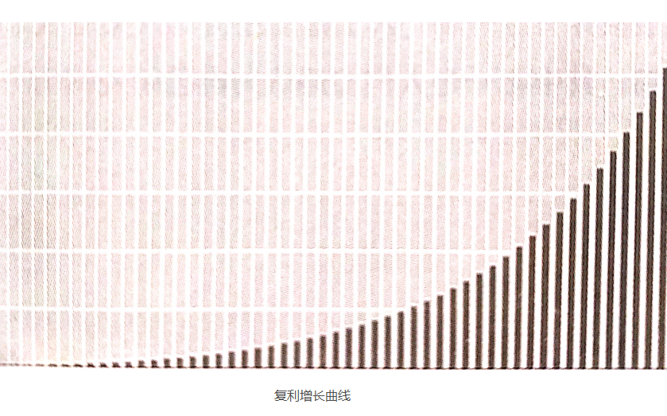

## 尾记：如何成为一个更幸福的人？

下面的内容看起来像是额外话，可实际上并不是。

西方人杜撰的影响、超人是会飞的，中国神话中的神仙也是会飞的，可他们的姿势却不一样——超人是趴着飞的，神仙是站着飞的。为什么呢？因为即便是杜撰出来的人物，也要符合一定的科学原理。超人趴着飞是有道理的，因为那个姿势可以减少空气阻力带来的影响；神仙站着飞也是有道理的，因为在神仙被杜撰出来的年代，人们的脑子（操作系统）里还没有“空气阻力”这个概念（所以用今天的眼光来看就显得有点“缺心眼儿”）。

为什么这不是题外话呢？因为这个例子清楚地告诉我们：无论看起来多么荒谬的现象，背后都有一定的道理存在。

相信《通往财富自由之路》专栏和这本书的读者，在这方面的感受尤为强烈：

> 当你尝试这进步的时候，你遇到的更可能是打击，而不是鼓励。

**相信我，你并不孤独。**

> 这是我的父亲经常对我说的话，他一直陪伴着我。每当有不好的事情发生在我身上的时候，父亲就会笑嘻嘻地对我说这句话。后来，我发现这绝对是一个客观描述，如果我遭遇不幸，那我也绝对不是“唯一一个遭遇不幸的人”——这真的是我一生中最“治愈”的句子。

起初，我并不理解。我觉得，进步本身就是件好事啊！难道不是每个人都追求进步吗？为什么有些人永远都在给别人泼冷水呢？为什么有些人要做这种损人利己的事呢？而且，为什么不仅是“有些人”，甚至是“绝大多数人”会这么做呢？真的很奇怪！

观察能力、思考能力、通感能力、反思能力，真的不是一两天就可以精通的，即便我总是很想知道答案，也要等上许多年才能明白其中的道理。

所有的人都希望自己进步，这绝对没错。但与此同时，进步绝对不是自动发生的，它天然就是耗时费力的，就是在很长的一段时间里根本看不出效果的。因为所有真正意义的进步，最终都会像复利曲线一样，在经过那个“长期”之前，都像是“恒定没有斜率的直线”，只有经过“长期”，已经读过某个时间点，才会有“肉眼可见”的“飞扬”。

而另外一个事实又是确定的：每时每刻，绝大多数人都一样，并非处于“飞扬”的阶段，而是在自然而然地体会着“昨天和今天有什么不同”。与此同时，绝大多数人并未学会“如何呵护自己的希望”，那希望的烛光随时可能被一阵莫名其妙的风吹灭——哪怕只是一个走路虎虎生风的人经过，都可能弄灭那烛光。

在这种情况下，请问：有谁喜欢自己被证明为退步呢？

你进步了，就意味着其他人相对退步了。从你的角度出发，当你看到身边的人进步了，而自己依然原地踏步的时候，你是不是会焦虑？如果答案是肯定的，那么反过来，假设你的确进步了，你身边的人是不是同样会焦虑？再进一步，请问：焦虑是不是绝大多人以为的负面情绪？

没有人喜欢退步，没有人喜欢相对退步，没有人习惯被动退步（即，被证明为退步）。反正，没有人喜欢被证明为退步——你也不喜欢，不是吗？

不开心！——这是所有人作出莫名其妙的选择或行动的根本原因（或者说“动力”）。换句话讲，为什么会有人泼你冷水，为什会有人说你坏话，为什么会有人不阴不阳地对待你？原因很简单：你让他们不开心了！

也许你会想：又不是我让他们不开心的，是他们自己太虚弱，是他们自己选择不开心！虽然有一定道理，可这不过是一面之辞，还有很多你没有考虑到的因素在发挥作用。

这事儿确实怪你的更深层次的原因在于：

> 一切的进步都不是一蹴而就的。一切的进步在起点上只不过是“愿望”而已，实际上的进步是需要行动支持的——不仅需要行动，还需要长期持续的行动，即，在“肉眼可见”的“飞扬”发生之前还需要很长时间。

于是，当你“表现自己”，或者尝试“证明自己”，甚至不小心“好为人师”的时候，从本质上看，你是在用尚未发生的结果去表现、去证明。从更深层次的视角去看，事实上**是你自己在“占便宜”**——你在用未来不一定会产生的结果刷当下的存在感。要知道，即便进行了长期持续的行动，也可能因为运气不好而无法获得预期的结果。

然而，对方其实不见得能想得那么清楚（事实上，他们肯定不好想得这么清楚，否则他们会有截然相反的态度），但这并不妨碍他们会隐隐地或者清楚地感觉到自己“吃亏了”，于是，他们必然会有所反应（也可以称为“反弹”），他们无论如何都会有“反抗”或者“反击”的冲动。这个机理是普适的，否则不可能出现如此大面积的类似行为。古今中外都一样，不分年龄、性别，不分种族、国界，绝大多数人都会不由自主地采取负面的决策和行动——只要你声称自己在进步，就会有无数人冒出来，要么打击你，要么嘲讽你，甚至暗害你，或者憋着劲儿等着，只要一出现机会，就跳出来证明你的所作所为都是徒劳！

你要给自己洗脑了。如果再遇到向你泼冷水的人，再遇到说风凉话的人，再遇到在背后坑害你的人，那不必那么肤浅地把对方定义为“坏人”了——从更深的层次分析，使你做“错”了，是你让他们不开心了，是你“占便宜未遂”。虽然他们也不一定是“好人”，但你确实有“错”，而且“错”得不浅。

我和你一样，在年轻的时候觉得这个世界“充满了恶意”，觉得自己好像一只在丛林里挣扎着生存的兔子，四处都有威胁，四处都是陷阱，随时都可能被别的动物攻击。偶尔得空，也总是不由自主地哀叹：为什么我天生是兔子，而不是豹子？然后也会好奇:若我天生是豹子，会整天欺负兔子吗？

终于有一天，我觉醒了。根源在哪里呢？因为我发现了自己对“丛林类比”的一个理解漏洞。我们所生存的社会确实像一个“险恶”的丛林，丛林里有各种各样的动物，他们用各种各样适合自己的方式生存，互相捕食，拼命繁衍，每天杀戮不断，却也生生不息。这个类比在这个层面是相当准确的，但有个细节被我忽略了——是什么呢？在这个丛林里，有些个体能从一个物种“进化”成另外一个物种的，也就是说，有些兔子可能“进化”成豹子（反过来也一样，有些豹子可能“退化”成兔子）。还有一个现实是，兔子肯定不是一下子就变成豹子的，它也许要先变成狼，再变成野猪，然后才变成豹子，以后还可能变成狮子或者大象。虽然这个丛林里的绝大多数动物，生来是什么，死去的时候还是什么，但这毕竟不是大自然里的丛林。在这个类比的“丛林”里，某些个体的“进化”速度可以达到“不可想象”的程度。

这对我来说是个至关重要的领悟，若20多年前它没有发生，今天的我就不会存在——也许我依然是那个只在丛林里每天心惊胆颤地逃亡而不知道明天会怎样的兔子。

琢磨清楚这些道理之后，我开始厘清思路：

> ▷让别人不开心，是自己不对，自己不周到。
>
> ▷一切“进化”（你看，我甚至不再用“进步”这个词了）都是“长期”之后的未来结果，不是今天就能拿出来展示和证明的。
>
> ▷拿尚未发生的事情说事儿、讲理，尽管不一定是错的，但通常不会被别人正确理解。
>
> ▷人们不理解你的时候，自然不会支持你。
>
> ▷证明自己是没有必要的，若做到了就无须证明，若没做到则证明也是徒劳。
>
> ▷自己给自己引来很多攻击，不仅是愚蠢的，更是致命的。

那该怎么办？

> **默默地完成进化。**

最佳策略选择完成。

在进化完成之前，不说，不表现，不好为人师，因为说了也没用，表现了也证明不了，在那种情况下好为人师只能令人厌恶，而且多半会被理解或者证明为“虚伪”（大约10年前，我发表过一篇文章，标题是《成为能说那话的人》）。

现在，我写专栏，有十几万人订阅。虽然专栏里面讲的道理中有很多是我十几二十年前就想明白并且践行了的，可若十几二十年前的李笑来跳出来做同样的事情，会有同样的效果吗？肯定不会——“人微言轻”是有道理的。

还有一个小问题：怎样让自己变成一只受欢迎的兔子，甚至连豹子都喜欢的兔子，或者连蛇都不讨厌的兔子？这个问题更为严肃——若有解决方案，那一路上会少多少威胁和危险啊!

最初的策略很初级：做一只欢乐的兔子。事实上，乐观并不是天生的。乐观是一种选择，一种能力，一种相信明天会更好的选择与能力。我猜你早就观察到了，我们身边总有那么一两个人，在任何时候都是笑嘻嘻、乐呵呵的，做什么事情都像“打了鸡血”一样兴奋，哪怕遇到再大的挫折，也就是垂头丧气一会儿，然后依然像什么都没发生一样欢乐地活着。我发现，他们都很招人喜欢。反正，我很清楚：我自己很喜欢这种人。

我要成为这种人。心理学研究成果对我帮助很大，因为我知道：一切欢乐，其实都只不过是多巴胺分泌处于平均水平以上的结果。于是，事情就变得简单了：多学习、多运动，人自然就开心起来了！当然，还有辅助的方法：在人群中寻找那些欢乐的人，与他们为伍。

随着时间的推移，我终于找到了升级的策略（而且是更有效率的策略）：成为一只励志的兔子。当然，不是那种整天宣扬成功学的兔子——我要成为一个鼓励所有人的人。理由也很简单：既然那么讨厌被别人泼冷水，被别人说风凉话，被别人陷害，就无论如何不应该成为那样的人；不仅如此，还有站到他们的对面，成为一个善于鼓励他人的人。

“鼓励”绝对是这世界的稀缺资源——我相信你早就有深刻的体会。如果你是个善于鼓励他人的人，那么你起码会直接获得两个好处。首先，你身边的人会不由自主地喜欢你——谁不喜欢拥有稀缺资源的人呢？更为重要的是，随着你不断鼓励他人，不断看到因为你的鼓励而继续前行的人获得了他们所期待的结果，你会慢慢变成一个无须他人鼓励的人——你早就变成了正能量本身。后面这个好处实在是个意外惊喜，也实在是个极度惊人的意外惊喜，不信你就试试看。

一旦开始做，你就会知道，鼓励他人真的很简单，一句朴素的“我支持你”就已经足够，甚至在更多的时候，你连这句话都不用说，只需要默默地陪伴一会儿就已经完成了对他人真正的鼓励。有时我也很震惊：这么简单的事儿，怎么就很少有人去做呢？

一路走过来，另外一个策略也自然而然地形成了：即便“进化”成了豹子，也不应该欺负兔子。

这个丛林本身也在“进化”。在过去，丛林里确实常常是“你死我活”的局面。现在呢？丛林本身变了，变化太快，机会太多，因此，相互捕食变得“成本过分高昂”——还不如自己忙活自己的呢！就像在几千年前，人类发展了农业之后，战争就自然而然地减少了许多个量级一样；也像科技发展到今天，“和平”成了刚需一样。只有输赢和对立的时代已经过去，双赢、多赢的局面和机会变得更多，出现得更频繁。于是，人们的价值观发生了变化，只要聪明一点，大部分人都能找到“独善其身”的位置。

我们生活在一个更好的丛林里，而这个丛林理论上会变得越来越好，不是吗？

[**返回目录**](./menu.md)
